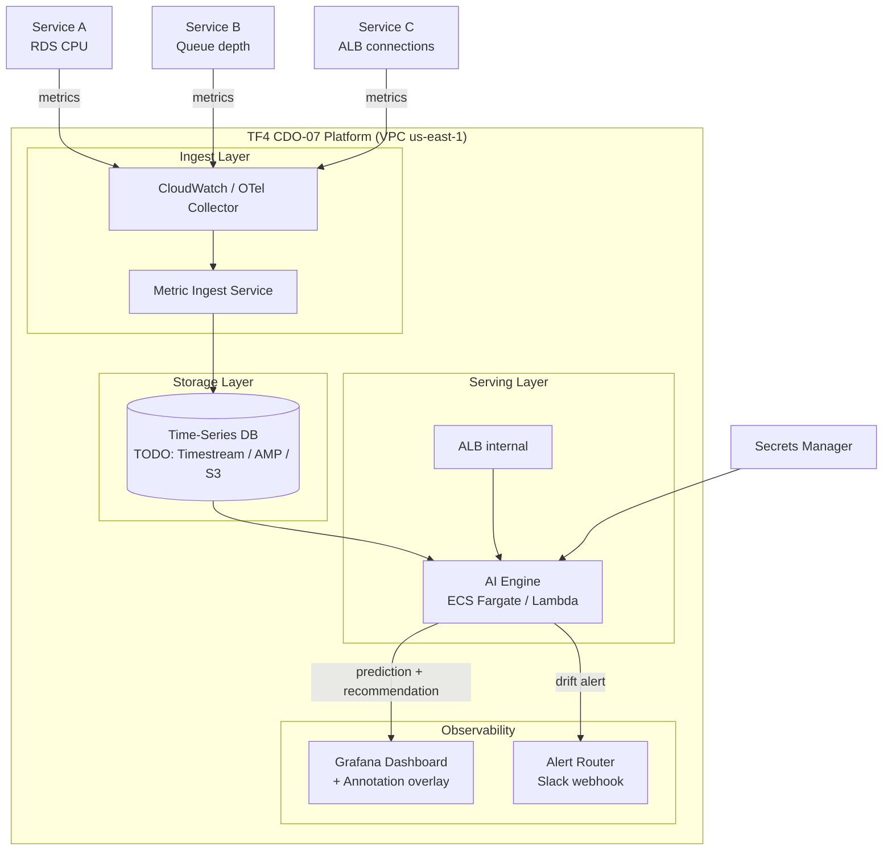

# Infrastructure Design - Task Force 4 · CDO-07

<!-- Doc owner: CDO-07
     Status: Draft (W11 T3-T4) → Final (W11 T6 Pack #1) → Updated (W12 T4 Pack #2)
     Word target: 1500-2500 từ
     Last updated: 2026-06-22 -->

## 1. Architecture diagram

<!-- TODO: Cập nhật diagram sau khi lock differentiation angle (T3 W11) -->
<!-- Diagram dưới là placeholder - thay bằng angle thực tế của CDO-07 -->



*Caption: TODO - Điền mô tả flow sau khi chốt angle. Luồng chính: metric từ 3 tier-1 service
→ ingest → TSDB → AI engine predict drift → annotation lên Grafana + alert Slack.*

## 2. Component table

<!-- TODO: Cập nhật AWS service cụ thể sau khi lock angle -->

| Component | AWS Service | Reason | Cost estimate |
|---|---|---|---|
| Metric ingest | `< TODO: Kinesis / CW Agent / OTel >` | `< TODO >` | $X |
| Time-series storage | `< TODO: Timestream / AMP / S3+Athena >` | Support time-series query TF4 req | $X |
| AI engine compute | `< TODO: Fargate / Lambda >` | `< TODO >` | $X |
| API entry | `< TODO: API GW / ALB >` | `< TODO >` | $X |
| Alert routing | SQS + Lambda + Slack webhook | Decouple alert fan-out | ~$0 (free tier) |
| Dashboard | `< TODO: Managed Grafana / QuickSight >` | Grafana annotation embed req TF4 | $X |
| Secrets | AWS Secrets Manager | Bedrock key, DB creds, webhook key | ~$1/secret/month |
| Observability | CloudWatch + X-Ray | Native AWS, no extra infra | Pay-per-use |
| IaC state | S3 + DynamoDB lock | Remote state, no Terraform Cloud needed | ~$1/month |

## 3. Differentiation angle deep-dive

<!-- TODO: Fill sau khi lock angle T3 W11 -->

### 3.1 Why this angle?

`< TODO: Tại sao chọn angle này cho TF4 Foresight Lens? Liên hệ với yêu cầu high-volume
time-series (50k events/sec), lead time ≥15 phút, Grafana annotation. >`

### 3.2 Vượt trội ở đâu (số liệu)

<!-- TODO: Điền sau khi có benchmark estimate -->

| Axis | CDO-07 estimate | CDO khác estimate |
|---|---|---|
| Cost / service / month | $X | TBD |
| P99 ingest latency | Xms | TBD |
| P99 predict latency | Xms | TBD |
| Ops overhead | X hr/week | TBD |
| Time to onboard service | X min | TBD |
| Historical retention cost | $X/GB/month | TBD |

### 3.3 Weakness chấp nhận

`< TODO: Honest về trade-off của angle chọn. Ví dụ: cold start nếu Lambda, cost cao nếu
Managed Grafana, latency cao nếu lakehouse batch. >`

## 4. Multi-tenant approach

### 4.1 Tenant model (TF4 context = per-service baseline)

- **Tenant definition trong TF4**: mỗi `service_id` là một "tenant" logic
- **Tenant ID format**: `{service_name}-{env}` (vd `payment-gateway-prod`)
- **Header**: `X-Tenant-Id` mandatory trên mọi API call tới AI engine
- **Subscription tiers**: tier-1 (full baseline + alert) / tier-2 (design-only cho capstone)
- **Schema bắt buộc** (per TF4 contract): `service_id` + `metric_type` + `tenant_id` trên mọi metric event

### 4.2 Isolation pattern

<!-- TODO: Chọn pattern sau khi lock angle -->

- **Data isolation**: `< TODO: pool (shared TSDB, row-level filter by service_id) / silo (per-service table) >`
- **Compute isolation**: shared Fargate task, logic tenant filter tại application layer
- **Why this pattern**: `< TODO: cost vs isolation strength trade-off >`
- **Noisy neighbor mitigation**: per-service ingest rate limit (X events/sec/service), circuit breaker nếu vượt

### 4.3 Service onboarding flow

```
1. POST /platform/v1/services (service_name, metric_schema, tier)
2. Step Function trigger:
   a. Tạo metric namespace trong TSDB
   b. Tạo IAM scoped role cho service
   c. Tạo Grafana datasource + dashboard template
   d. Khởi tạo baseline training job (manual trigger)
3. Smoke test: gửi synthetic metric → verify TSDB write
4. Callback: service ready (target < 30 min)
```

### 4.4 Noisy neighbor mitigation

- Per-service ingest quota: `< TODO: X events/sec >`
- API rate limit AI engine: `< TODO: X req/min/service >`
- CloudWatch alarm nếu single service > 20% total ingest volume

## 5. Alternatives considered

<!-- TODO: Fill sau khi quyết định - dùng làm input cho ADR-001, ADR-002 -->

### 5.1 Time-series storage

- **Option A - Amazon Timestream**: managed, native time-series SQL, low ops overhead.
  Pros: no infra management, built-in time-series functions. Cons: higher cost at scale,
  vendor lock-in.
- **Option B - Amazon Managed Prometheus (AMP)**: Prometheus-compatible, tích hợp Grafana
  native. Pros: familiar PromQL, Grafana out-of-the-box. Cons: pull-based, cần scrape config.
- **Option C - S3 + Athena (Lakehouse)**: cheapest long-term storage, serverless query.
  Pros: $0.023/GB vs $X Timestream. Cons: latency query cao (seconds), không realtime.
- ✅ **Chosen**: `< TODO >` - Reason: `< TODO >`

### 5.2 Compute layer (AI engine hosting)

- **Option A - Lambda**: pay-per-invocation, zero idle cost, auto-scale.
  Pros: cost. Cons: cold start ~500ms, 15min timeout, 10GB memory limit.
- **Option B - ECS Fargate**: always-on, predictable latency, no cold start.
  Pros: consistent P99. Cons: higher fixed cost (~$30/month per task).
- **Option C - ECS Fargate Spot**: 70% cheaper than on-demand.
  Pros: cost saving. Cons: spot interruption risk (fallback needed).
- ✅ **Chosen**: `< TODO >` - Reason: `< TODO >`

### 5.3 Dashboard

- **Option A - Amazon Managed Grafana**: native annotation API, no self-host.
  Pros: TF4 yêu cầu embed annotation vào Grafana existing. Cons: $9/user/month.
- **Option B - Self-hosted Grafana on ECS**: free, full control.
  Pros: no license cost. Cons: ops overhead, manage upgrade.
- **Option C - Amazon QuickSight**: Finance-friendly (relevant TF2 not TF4).
  Pros: business user friendly. Cons: không native Prometheus/CloudWatch Metrics annotation.
- ✅ **Chosen**: `< TODO >` - Reason: `< TODO >`

## 6. Scaling strategy

<!-- TODO: Điền trigger values sau khi chọn compute -->

- **Vertical**: increase Fargate task CPU/memory nếu sustained CPU > 80%
- **Horizontal**: ECS Service Auto Scaling target CPU 70% hoặc custom metric (ingest queue depth)
- **Ingest scale trigger**: Kinesis shard auto-scaling nếu dùng Kinesis (GetRecords.IteratorAgeMilliseconds > 30s)
- **AI engine scale trigger**: request count > X req/min → scale out, idle 10min → scale in

## 7. Failure modes + recovery

| Failure | Detection | Recovery | RTO | RPO |
|---|---|---|---|---|
| AI engine task crash | ECS health check / ALB 5xx | ECS auto-restart | < 60s | 0 |
| TSDB unavailable | CloudWatch alarm on write errors | Fallback: buffer to SQS, retry | < 5min | < 1min data |
| Metric ingest spike (50k events/sec) | CloudWatch ingest throughput alarm | Auto-scale ingest layer | < 3min | 0 |
| AI engine down (predict) | ALB 503 | **Fail-open: fallback to static threshold** | < 30s | N/A |
| Grafana annotation API down | Lambda error alarm | Retry with exponential backoff (3 attempts) | < 5min | annotation delayed |
| AZ outage | CloudWatch cross-AZ alarm | Multi-AZ Fargate tasks auto-redistribute | < 5min | < 1min |

> **Fail-open fallback**: per TF4 hard requirement - khi serving endpoint down, fallback về
> static threshold alert thay vì silent failure. Implement bằng Circuit Breaker pattern.

---

## Related documents

- [`03_security_design.md`](03_security_design.md) - Network Security + IAM + Data encryption
- [`04_deployment_design.md`](04_deployment_design.md) - IaC + CI/CD + GitOps cho infra này
- [`05_cost_analysis.md`](05_cost_analysis.md) - Per-service cost model based on this infra
- [`08_adrs.md`](08_adrs.md) - ADR-001 (TSDB choice), ADR-002 (Compute choice), ADR-003 (Dashboard)
