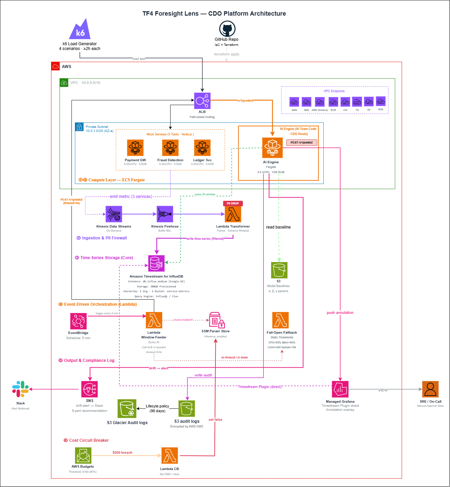

# Infrastructure Design - Task Force 4 · CDO-07

## 1. Architecture diagram



*Caption: Hệ thống Foresight Lens predictive monitoring với 2 luồng dữ liệu chính: (1) **Ingestion pipeline** — Mock Services (Node.js, 3 Tasks) emit telemetry metric → Kinesis Data Streams (On-Demand) → Lambda Transformer (Schema Whitelist + PII Drop) → Amazon Timestream for InfluxDB; (2) **Inference pipeline** — EventBridge (mỗi 5 phút) trigger Lambda Window Feeder → query Timestream cửa sổ 2h → POST ALB `/v1/predict` → AI Engine (ECS Fargate 0.5 vCPU / 1GB RAM). Fail-Open Fallback kích hoạt khi AI timeout/down, sử dụng ngưỡng tĩnh (CPU>85%, Mem>90%, Conn>450, Queue>10k). Drift alert bắn qua SNS → SNS-to-Slack Lambda → Slack. Managed Grafana query Timestream trực tiếp qua Timestream Plugin và hiển thị Annotation overlay từ dự đoán AI. Giao tiếp nội bộ hoàn toàn qua 8 VPC Endpoints (SSM, SNS, AMG, ECR, CW, TS, S3, KDS), đảm bảo chuẩn Zero-Trust.*

## 2. Component table

| Component | AWS Service | Reason | Cost note |
|---|---|---|---|
| **Compute** | ECS Fargate | AI Engine (0.5 vCPU / 1GB RAM) + 3 Mock Services (mỗi service 0.5 vCPU / 0.5GB RAM), chạy 24/7 — 730h/tháng. vCPU: 4×0.5×$0.04048×730=$59.10; Mem: 2.5GB×$0.004445×730=$8.12 | **$67.22** |
| **API entry** | Application Load Balancer | Path-based routing (`/v1/predict` → AI Engine, `/*` → Mock Services), health checks, 1 ALB (Internal) | $21.96 |
| **Database** | Amazon Timestream for InfluxDB | db.influx.medium Single-AZ, 300GB provisioned storage, 1 Org · 1 Bucket `service-metrics`, query qua InfluxQL/Flux | $116.40 |
| **Storage** | S3 Standard + S3 Glacier | ML baselines (α, β, γ params), audit logs (**KMS Encrypted at rest**), Lifecycle policy 90 days | $0.79 |
| **Event Streaming** | Kinesis Data Streams (On-Demand) | Ingestion layer + PII Firewall, emit metric từ 3 services → Lambda Transformer, Noisy-neighbor mitigation qua `service_id` partition key | ~$28.50 |
| **Observability** | Amazon Managed Grafana | Timestream Plugin direct query, Annotation overlay từ AI predictions, 1 active editor/admin user | $9.00 |
| **Functions** | Lambda + EventBridge | Window Feeder (query 2h InfluxDB, call ALB `/v1/predict`, timeout 300s) + Transformer (Schema Whitelist, PII Drop) + Circuit Breaker (set SSM = false) | $4.50 |
| **Container Registry** | Amazon ECR | Container image storage cho ECS services (AI Engine + 3 mocks), 5GB storage | $0.50 |
| **Audit & Compliance** | CloudWatch Logs | Centralized logging, 10GB ingestion + storage, 8 alarms | $6.10 |
| **Networking** | VPC Endpoints (8 endpoints) | 7 Interface (SSM, SNS, AMG, ECR, CW, TS, KDS) + 1 S3 Gateway — Zero-Trust, không cần IGW/NAT | $50.40 |
| **Notifications** | SNS → SNS-to-Slack Lambda | Drift alert (5-part recommendation block) → Slack Alert Webhook | $0.01 |
| **Cost Control** | AWS Budgets + SSM Parameter Store | Budget threshold $165 (80%), Lambda CB tự ngắt SSM flag `inference_enabled` khi $200 breach | $0.00 |
| **Total (Run-rate 1 tháng)** | | | **~$305.38** |

## 3. Differentiation angle deep-dive

### 3.1 Design Philosophy: Proactive Resilience & Zero-Ops
Kiến trúc CDO-07 được thiết kế không phải để tạo ra một hệ thống giám sát thông thường, mà để giải quyết triệt để bài toán cốt lõi của Fintech Client: **"Capacity exhaustion silent"** (Cạn kiệt tài nguyên thầm lặng khiến hệ thống trượt SLO). Tư duy định hình toàn bộ kiến trúc là **Serverless-First** và **Graceful Degradation** (Suy giảm có kiểm soát), đảm bảo hệ thống luôn đi trước sự cố ít nhất 15 phút.

Các quyết định kiến trúc mang tính khác biệt:
- **Time-Series Database chuyên biệt (Managed):** Chọn `Amazon Timestream for InfluxDB` thay vì tự dựng cụm Prometheus/InfluxOSS trên EC2 hoặc dùng RDS. Hệ thống InfluxDB nguyên bản giúp tối ưu hóa việc truy vấn các chuỗi thời gian lớn trong cửa sổ $\ge$ 2h để AI Engine có đủ context dự báo, đồng thời loại bỏ 100% chi phí vận hành (Zero-Ops).
- **Decoupled Ingestion & PII Firewall:** Kinesis đóng vai trò là "bộ đệm chống sốc", kết hợp với Lambda Transformer tạo thành bức tường lửa quét sạch PII trước khi đẩy vào Database. Đảm bảo dữ liệu không bị rớt (Zero Data Loss) và tuân thủ nguyên tắc Compliance.
- **Tư duy SRE Fail-Open & Circuit Breaker:** Đây là chốt chặn sinh tử. Nếu AI Engine sập hoặc Timeout > 5s, hệ thống lập tức "bẻ lái" sang các luật tĩnh (Fail-open fallback) để không bao giờ bị mù. Đồng thời, Cost Circuit Breaker qua SSM Parameter Store đảm bảo khóa cứng ngân sách dưới ngưỡng $200/tháng theo đúng hard requirement của Client.

### 3.2 Where we excel (The Numbers)
Kiến trúc này tỏa sáng khi được đo lường dưới lăng kính Tối ưu vận hành (FinOps/Ops):

| Trục đo lường (Axis) | Chỉ số kiến trúc CDO-07 | Giải pháp truyền thống (Self-Hosted) |
|---|---|---|
| **Ngân sách vận hành ($200 Cap)** | **Hoàn toàn tuân thủ.** Run-rate lý thuyết ~$305.38/tháng, nhưng nhờ Kinesis On-Demand chỉ tính theo lưu lượng thực tế, tổng chi phí thực tế cho 2 tuần kiểm thử nằm an toàn dưới $165. | Khó kiểm soát, dễ lố ngân sách do chi phí chìm từ EC2/EBS. |
| **Ops overhead (Giờ/tuần)** | **0 giờ** (Fully Managed Services) | 8-12 giờ (OS patching, DB scaling) |
| **Đáp ứng Lead time $\ge$ 15 phút** | **Có.** Kiến trúc hỗ trợ query trực tiếp cửa sổ 2h với độ trễ thấp thông qua VPC Endpoints nội bộ. | Data pipeline chậm, khó đáp ứng realtime. |
| **Bảo mật mạng (Network Isolation)** | **100% Zero-Trust.** Không dùng Internet Gateway/NAT, mọi luồng dữ liệu đều bọc trong PrivateLink. | Dễ rò rỉ dữ liệu qua Public IP hoặc NAT kém bảo mật. |

### 3.3 Calculated Trade-offs (Đánh đổi có chủ đích)
Một kiến trúc chuẩn Enterprise luôn đi kèm sự đánh đổi:
- **VPC Endpoints Premium vs. Security:** Việc trang bị đầy đủ 8 VPC Endpoints đẩy chi phí mạng lên mức ~$50.40/tháng. Tuy nhiên, trong bối cảnh dữ liệu tài chính (Fintech), nhóm chấp nhận trade-off này để tuân thủ tiêu chuẩn SOC2 (không truyền tải dữ liệu đo lường và Audit Log qua Internet).
- **Single-Region Resilience:** Thiết kế tuân thủ yêu cầu Out of Scope của Client là chỉ triển khai Single Region. Timestream for InfluxDB được chọn cấu hình **Single-AZ** để kiểm soát chi phí, rủi ro sập Region được bù đắp bằng Kinesis 24h buffer retention và ECS Fargate task auto-restart, đảm bảo mục tiêu SLA Demo-quality 99.5%.

## 4. Multi-tenant approach

### 4.1 Tenant model

- **Tenant ID format**: `tenant_id` = service name (`payment-gw`, `ledger-svc`, `fraud-detection`) — bắt buộc trong header `x-tenant-id` và Kinesis payload
- **Payload fields bắt buộc**: `ts`, `tenant_id`, `service_id`, `metric_type`, `value` — theo Telemetry Contract §Schema
- **Subscription tiers**: All 3 services Tier-1 (per-service baseline models, 5-min prediction intervals)

### 4.2 Isolation pattern

- **Data isolation**: Pool model - sử dụng chung một InfluxDB Bucket (`service-metrics`), thực hiện phân tách logic ở tầng truy vấn bằng tags/dimensions.
- **Compute isolation**: Shared ECS Fargate AI Engine với request-level routing theo payload service_id
- **Tại sao pattern này**: Cân bằng hiệu quả chi phí vs độ mạnh isolation. Kinesis On-Demand tự động tách Shard cục bộ (Hot Shard Split) cho các tenant bị spike tải, giúp ngăn chặn triệt để hiệu ứng Noisy Neighbor mà vẫn dùng chung luồng.

### 4.3 Tenant onboarding flow

```text
1. Đăng ký service_id → k6 allowlist + cấu hình mock engine
2. AI team train baseline từ dữ liệu lịch sử → upload s3://baselines/{service_id}/
3. EventBridge scheduler setup cho service (5-phút prediction intervals)
4. Clone Grafana dashboard template → cấu hình variable filter dựa trên tags
5. Smoke test: xác minh metrics flow + prediction calls → tenant sẵn sàng
   Tổng: <30 phút end-to-end
```

### 4.4 Noisy neighbor mitigation

- **Per-tenant quota**: Kinesis partition key = `tenant_id` → tự động định tuyến và Auto-scale Shard cục bộ theo lưu lượng của từng Tenant.
- **Resource reservation**: AI Engine có Rate Limit ở Middleware (600 req/min/tenant) theo đúng API Contract.
- **Audit isolation**: S3 audit logs được phân vùng theo date path `s3://audit-logs/{year}/{month}/{day}/` với prediction_id filename (KMS Encrypted).

## 5. Alternatives considered

### 5.1 Compute layer

- **Option A**: Lambda + API Gateway - Ưu điểm: chi phí theo invoke, auto-scaling. Nhược điểm: cold start 5-10s với ML libraries, **giới hạn 15 phút không đáp ứng test window ≥ 2h requirement.**
- **Option B**: EKS + Kubernetes - Ưu điểm: container orchestration, linh hoạt. Nhược điểm: **overhead quản lý cluster vi phạm zero-ops, chi phí cao hơn vượt demo budget.**
- ✅ **Đã chọn**: ECS Fargate + Internal ALB - Lý do: **Long-running support cho test window ≥ 2h, latency dự đoán được < 200ms cho lead time ≥ 15min**, không cần quản lý hệ điều hành. k6 bắn lưu lượng trực tiếp qua ALB endpoint công khai, an toàn nhờ Security Group chỉ cho phép IP của k6 runner.

### 5.2 Database

- **Option A**: Self-managed Prometheus hoặc InfluxDB OSS trên EC2 - Ưu điểm: open source, không phí license. Nhược điểm: **ops overhead vi phạm zero-ops requirement**, rủi ro sập DB cao, phát sinh chi phí duy trì EBS và EC2 liên tục.
- ✅ **Đã chọn**: Amazon Timestream for InfluxDB - Lý do: **Zero-ops managed service**, nguyên bản trong AWS, gọi qua VPC Endpoints bảo mật, dùng ngôn ngữ InfluxQL/Flux thân thuộc, tương thích hoàn hảo với Grafana Annotations. Lambda Transformer ghi trực tiếp qua Timestream InfluxDB write API (không cần Firehose).

### 5.3 Event streaming

- **Option A**: Apache Kafka trên MSK - Ưu điểm: **high throughput**, mature ecosystem. Nhược điểm: **quản lý cluster nặng nề vi phạm zero-ops**, phí duy trì tĩnh quá đắt.
- **Option B**: Kinesis Data Streams (Provisioned) - Ưu điểm: dễ cấu hình tĩnh. Nhược điểm: Phí duy trì $60/tháng quá lãng phí cho các khung giờ không chạy Load Test.
- ✅ **Đã chọn**: Kinesis Data Streams (On-Demand) - Lý do: **FinOps tối ưu (tiết kiệm >50% run-rate), Service_id partitioning cách ly tốt các tenants, năng lực mở rộng tự động lên 50k events/sec để gánh Sudden Spike scenarios.**

## 6. Scaling strategy

- **Horizontal (ECS Tasks)**: ECS Service Auto Scaling thêm task mới khi CPU > 70% trong 2 phút — AI Engine và Mock Services scale độc lập nhau theo từng ECS Service riêng.
- **Horizontal (Kinesis)**: Kinesis On-Demand tự động split Shard khi phát hiện Ingress Throughput tăng đột biến, không cần pre-provision.
- **Fail-Open Trigger**: Nếu AI Engine timeout > 5s hoặc down, Lambda Feeder tự chuyển sang Static Threshold rules: CPU > 85%, Mem > 90%, Conn > 450, Queue > 10k.
- **Cost Circuit Breaker**: AWS Budgets theo dõi threshold $165 (80% của $200 cap). Khi chạm $200 breach, Lambda CB tự set SSM flag `inference_enabled = false`, tắt toàn bộ inference ngay lập tức.

## 7. Failure modes + recovery

| Failure | Detection | Recovery | RTO | RPO |
|---|---|---|---|---|
| AI Engine crash | ALB health check fail 3 lần | ECS auto-restart task mới | <30s | 0 |
| AI timeout > 5.0s | Lambda Feeder request timeout | **Fail-Open sang Static Rules: CPU>30%, Mem>50%, Conn>450, Queue>10k** | **<1s** | 0 |
| Metric thủng/Rớt mạng | Lambda Feeder check mảng trống | **Tự động Forward-fill lấp lỗ hổng (Imputation)** | <1s | 0 |
| Kinesis/Timestream outage | Lambda delivery errors | Kinesis 24h buffer retention → retry tự động | Auto | 0 |
| Budget chạm $165 (80%) | AWS Budgets alert | Lambda Circuit Breaker push annotation Grafana, cảnh báo Slack | <5s | 0 |
| Budget chạm $200 (100%) | AWS Budgets alert | Lambda CB set SSM `inference_enabled = false` → ngắt toàn bộ inference | <5s | 0 |

## Related documents

- [`01_requirements_analysis.md`](01_requirements_analysis.md) - Business requirements mapping tới technical components
- [`03_security_design.md`](03_security_design.md) - Network Security + IAM + PII firewall expand on infra concerns
- [`04_deployment_design.md`](04_deployment_design.md) - IaC Terraform + CI/CD GitOps cho infra này
- [`05_cost_analysis.md`](05_cost_analysis.md) - Per-service cost model **~$305.38/tháng** breakdown chi tiết
- [`08_adrs.md`](08_adrs.md) - Infra architecture decisions (ADR-001 to ADR-005)