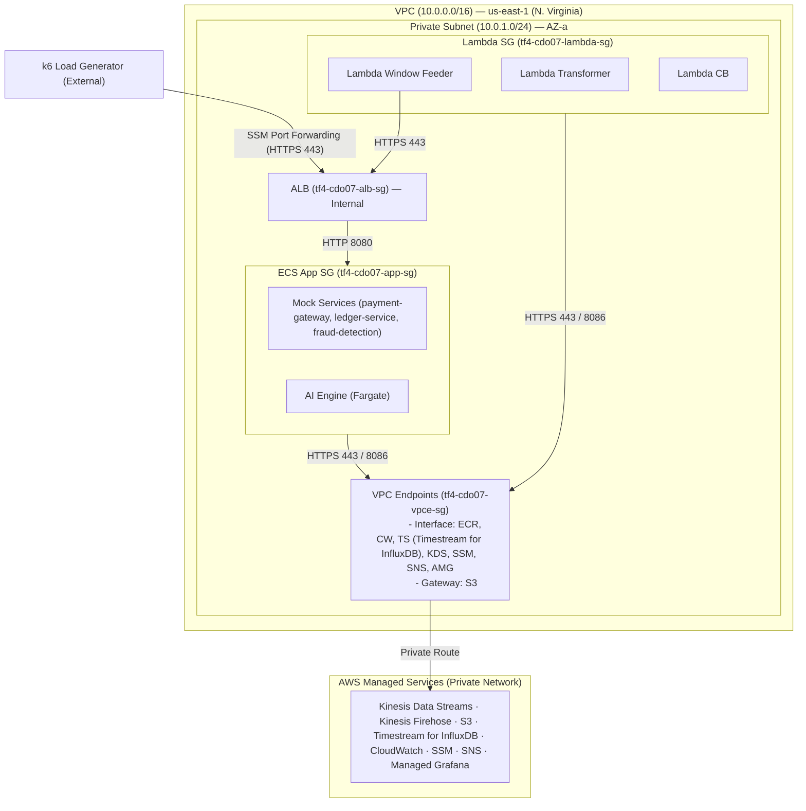
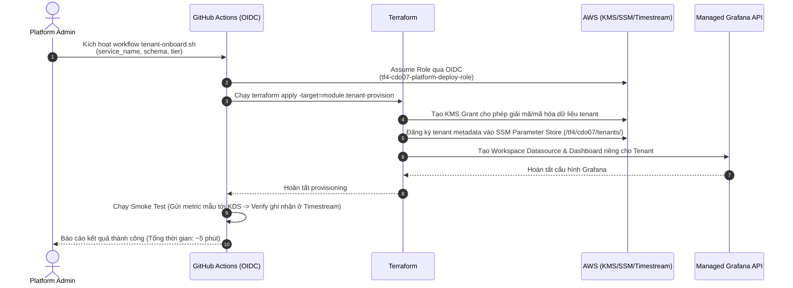

# Thiết kế Bảo mật - Task Force 4 · CDO-07

<!-- Doc owner: CDO-07
     Status: Draft (W11 T4) → Final (W11 T6 Pack #1) → Refined (W12 T4 Pack #2)
     Word target: 1200-2000 từ
     Last updated: 2026-06-22 -->

> **Phạm vi (Scope)**: Bảo mật ở cấp độ DevOps (network, IAM, secrets, encryption, audit).
> Không phải kiểm toán bảo mật doanh nghiệp (enterprise security audit). Tập trung vào những gì CDO-07 thực sự cấu hình và triển khai (deploy).
>
> **Yêu cầu tối thiểu W11 T6 (W11 T6 minimum)**: §1 + §2 + §3 + §4 + §5 (khung sườn / skeleton) + §7 (câu hỏi mở / open questions)
> **Bản hoàn thiện W12 T4 (W12 T4 final)**: tất cả các phần được tinh chỉnh với các minh chứng (IAM policy snippets, KMS ARN, audit log sample)

---

## 1. Bảo mật Mạng (Network Security)

### 1.1 Sơ đồ Bảo mật Mạng (Network Security Diagram)



> **Đồng bộ hạ tầng**: Sơ đồ trên phản ánh đúng cấu trúc mạng thực tế được thiết lập đồng bộ với tài liệu hạ tầng [`02_infra_design.md`](02_infra_design.md) và sơ đồ kiến trúc [`CDO7.drawio.png`](images/CDO7.drawio.png). Hệ thống được triển khai khép kín hoàn toàn trong một Subnet duy nhất là `Private Subnet (10.0.1.0/24)` và Application Load Balancer là **Internal ALB**, không sử dụng Internet Gateway hay NAT Gateway để đảm bảo chuẩn bảo mật Zero-Trust.

### 1.2 Các Nhóm Bảo mật (Security Groups)

| Tên SG (SG name) | Inbound | Outbound | Gắn với (Attached to) |
|---|---|---|---|
| `tf4-cdo07-alb-sg` | Port 80 (HTTP) từ `tf4-cdo07-lambda-sg` (Window Feeder → AI Engine) | 8080 (HTTP) → `tf4-cdo07-app-sg` (Mock Services & AI Engine), 8086 → `tf4-cdo07-influxdb-sg` | Application Load Balancer (Internal) — được quản lý bởi `terraform-aws-modules/alb` |
| `tf4-cdo07-lambda-sg` | (Không inbound — EventBridge trigger qua event source mapping nội bộ AWS) | 443 → `tf4-cdo07-vpce-sg` (VPC Endpoints), 8086 → `tf4-cdo07-influxdb-sg`, 80 → `tf4-cdo07-alb-sg` (Window Feeder → AI Engine) | Lambda Transformer, Lambda Window Feeder, Lambda CB, Lambda Fail-Open Fallback |
| `tf4-cdo07-vpce-sg` | 443 từ `tf4-cdo07-alb-sg` (ALB/ECS tasks) & `tf4-cdo07-lambda-sg` | (Không outbound — AWS-managed interface) | Tất cả Interface VPC Endpoints (ECR, Logs, SSM, KMS, KDS, Secrets Manager, SNS, Grafana) |
| `tf4-cdo07-influxdb-sg` | 8086 từ `tf4-cdo07-lambda-sg` & `tf4-cdo07-alb-sg` | (Không outbound cần thiết) | Timestream for InfluxDB instance |

> **Ghi chú triển khai**: Kiến trúc thực tế hợp nhất ECS Task SG vào ALB SG module (`terraform-aws-modules/alb`) thay vì tạo SG riêng `tf4-cdo07-app-sg`, giúp giảm số lượng SG cần quản lý. Kinesis Firehose là AWS-managed service, invoke Lambda qua event trigger nội bộ AWS nên không cần SG riêng.

> **Nguyên tắc**: Mọi SG đều dùng **source SG reference** thay vì CIDR trực tiếp để đảm bảo implicit deny khi các task hoặc function bị gỡ bỏ.

### 1.3 VPC Endpoints (Private Traffic, không đi qua Internet/NAT Gateway)

| Dịch vụ | Loại Endpoint | Mục đích |
|---|---|---|
| **ECR API** | Interface | Pull container image manifest cho ECS Tasks (Mock Services & AI Engine) |
| **ECR Docker** | Interface | Pull container image layers cho ECS Tasks |
| **CloudWatch Logs (logs)** | Interface | Đẩy log ứng dụng từ ECS Tasks & Lambda functions |
| **SSM** | Interface | Lambda Window Feeder và Lambda CB truy xuất/cập nhật cấu hình `inference_enabled` trong Parameter Store |
| **KMS** | Interface | Mã hóa/giải mã dữ liệu Kinesis, S3, SSM SecureString bằng CMK qua private network |
| **Kinesis Data Streams (KDS)** | Interface | Mock Services (ECS) ghi telemetry vào KDS qua private endpoint, không đi qua Internet |
| **Secrets Manager** | Interface | Lambda Transformer & Window Feeder đọc InfluxDB operator token được mã hóa |
| **SNS** | Interface | Lambda Window Feeder / Fail-Open Fallback / CloudWatch Alarms gửi drift alert tới Slack Webhook |
| **Managed Grafana (grafana)** | Interface | Truy cập Grafana API nội bộ |
| **Managed Grafana Workspace (grafana-workspace)** | Interface | Kết nối Grafana Workspace với datasource Timestream |
| **S3** | Gateway | Ghi AI audit logs, đọc baseline models, và lưu Terraform state (không tốn phí) |

> **Lưu ý**: Nhờ sử dụng VPC Endpoints cho toàn bộ lưu lượng dữ liệu nội bộ, hệ thống không cần triển khai NAT Gateway. Điều này giúp tối ưu hóa chi phí vận hành (~$0/tháng cho NAT), đáp ứng ngân sách capstone $200/tháng. Tổng cộng hệ thống trang bị **11 VPC Endpoints** (10 Interface + 1 S3 Gateway).
>
> * **Kinesis Firehose**: AWS managed service, invoke Lambda qua event trigger nội bộ AWS — không cần VPC Endpoint và không đi qua NAT.

### 1.4 Ingestion & PII Firewall (Lọc dữ liệu biên)

Để bảo vệ hệ thống trước các nguy cơ truy cập trái phép và lạm dụng API, hệ thống kết hợp cơ chế kiểm soát truy cập tầng mạng (Security Groups) trên Application Load Balancer (ALB) cùng với cơ chế PII & Ingestion Firewall tại tầng xử lý sự kiện:

| Thành phần | Cơ chế bảo vệ | Action |
|---|---|---|
| **Kinesis Data Streams** | Buffer an toàn ở lớp biên, chỉ cho phép HTTPS endpoints | Buffer metrics |
| **Lambda Transformer** | Lọc dữ liệu thô (Schema Whitelist) & loại bỏ PII (PII DROP) trước khi ghi vào TSDB | Whitelist + Drop |
| **SSM Parameter Store** | Quản lý trạng thái hệ thống (`InferenceEnabled`) để tự động ngắt khi có sự cố | Circuit Breaker |

---

## 2. IAM & Quản lý Truy cập (IAM & Access Control)

### 2.1 Các vai trò dịch vụ (Service Roles - least-privilege)

| Vai trò (Role) | Sử dụng bởi (Used by) | Quyền hạn chính (Key permissions) | KHÔNG có |
|---|---|---|---|
| `tf4-cdo07-ai-engine-task-role` | AI Engine (ECS Fargate) | `s3:PutObject` (audit bucket `tf4-cdo07-audit-log`), `s3:GetObject` (baseline bucket `tf4-cdo07-baseline-models`), `cloudwatch:PutMetricData`, `logs:PutLogEvents`, `kms:GenerateDataKey`, `kms:Decrypt` (CMK ARN) | `iam:*`, `s3:Delete*`, `ec2:*`, `timestream:*` |
| `tf4-cdo07-mock-svc-task-role` | Mock Services (ECS Fargate) | `kinesis:PutRecord`, `kinesis:PutRecords` (KDS Stream ARN), `cloudwatch:PutMetricData`, `logs:PutLogEvents`, `kms:GenerateDataKey` (mã hóa các bản ghi stream) | `timestream:*`, `s3:*`, `iam:*` |
| `tf4-cdo07-firehose-delivery-role` | Kinesis Data Firehose | `kinesis:GetRecords`, `kinesis:GetShardIterator`, `kinesis:DescribeStream` (đọc từ KDS), `lambda:InvokeFunction` (gọi Lambda Transformer), `s3:PutObject`, `s3:GetBucketLocation` (backup logs ghi lỗi), `kms:Decrypt` (giải mã stream) | `iam:*`, `timestream:*` (Firehose ghi vào Timestream for InfluxDB qua HTTP API sử dụng token) |
| `tf4-cdo07-lambda-transformer-role` | Lambda Transformer | `logs:CreateLogStream`, `logs:PutLogEvents` (ghi log hoạt động), `kms:Decrypt` (giải mã bản ghi nhạy cảm) | `s3:*`, `iam:*`, `kinesis:*`, `timestream:*` (không cần vì được Firehose gọi trực tiếp) |
| `tf4-cdo07-lambda-feeder-role` | Lambda Window Feeder | `ssm:GetParameter` (kiểm tra trạng thái `InferenceEnabled` và lấy InfluxDB query token), `sns:Publish` (scoped ARN: `arn:aws:sns:us-east-1:<ACCOUNT>:tf4-cdo07-alerts`), `kms:Decrypt` (giải mã tham số), `logs:PutLogEvents` | `s3:*`, `iam:*`, `timestream:*` (truy vấn Timestream for InfluxDB qua HTTP API sử dụng token) |
| `tf4-cdo07-lambda-cb-role` | Lambda CB (Cost CB) | `ssm:PutParameter` (cập nhật tham số `InferenceEnabled`), `kms:GenerateDataKey`, `kms:Decrypt`, `logs:PutLogEvents` | `s3:*`, `timestream:*`, `iam:*` |
| `tf4-cdo07-lambda-fallback-role` | Lambda Fail-Open Fallback | `sns:Publish` (ARN Topic alerts trong phạm vi / scoped ARN), `logs:PutLogEvents` | `iam:*`, `s3:*`, `timestream:*` |
| `tf4-cdo07-eventbridge-invoke-role` | EventBridge (chu kỳ 5 phút / 5-min schedule) | `lambda:InvokeFunction` (scoped ARN: `arn:aws:lambda:us-east-1:<ACCOUNT>:function:tf4-cdo07-window-feeder`) | `iam:*`, `s3:*`, `timestream:*`, `kms:*` |
| `tf4-cdo07-platform-deploy-role` | GitHub Actions CI/CD (OIDC) | `ecs:UpdateService`, `ecs:RegisterTaskDefinition`, `ecr:PutImage`, `ecr:GetAuthorizationToken`, `s3:PutObject` (tf-state bucket), `cloudformation:*` (scoped `tf4-cdo07-*` stack) | `iam:CreateUser`, `iam:CreateRole` (ngoài boundary), `s3:Delete*` production |
| `tf4-cdo07-readonly-role` | Quyền truy cập để Mentor đánh giá / gỡ lỗi (Mentor review / debug access) | `cloudwatch:GetMetricData`, `ecs:Describe*`, `timestream:Select`, `s3:GetObject` (audit bucket), `logs:GetLogEvents` | Mọi hành động ghi/thay đổi (write/mutate action) |

> **Ghi chú về phân quyền**:
> * **Gọi ALB `/v1/predict`**: `tf4-cdo07-lambda-feeder-role` không cần quyền IAM/API Gateway để gọi ALB `/v1/predict` vì ALB được triển khai dạng HTTP/HTTPS Endpoint chuẩn. Việc xác thực lưu lượng cuộc gọi được thực hiện bằng cách so khớp đặc quyền tầng mạng thông qua Security Group allowlist (từ `Lambda SG` tới `ALB SG`) kết hợp với cơ chế chữ ký HMAC tầng ứng dụng (như mô tả chi tiết tại **§4.2**).

### 2.2 OIDC cho CI/CD (không dùng static AWS key)

```yaml
# GitHub Actions - assume role via OIDC, không hardcode AWS Access Key
- uses: aws-actions/configure-aws-credentials@v4
  with:
    role-to-assume: arn:aws:iam::<ACCOUNT>:role/tf4-cdo07-platform-deploy-role
    aws-region: us-east-1
```

> **Tại sao OIDC?**  Loại bỏ thông tin xác thực tĩnh (static credentials như AWS_ACCESS_KEY_ID / SECRET) khỏi GitHub Secrets. Token tự hết hạn sau 1 giờ, làm giảm phạm vi ảnh hưởng (blast radius) nếu CI runner bị xâm nhập (compromise).

### 2.3 Ranh giới Quyền hạn (Permission Boundary)

- Boundary ARN: `arn:aws:iam::<ACCOUNT>:policy/tf4-cdo07-boundary`
- Thực thi: Không cho phép bất kỳ role nào tạo bởi `tf4-cdo07-platform-deploy-role` có quyền vượt ra ngoài phạm vi tài nguyên `tf4-cdo07-*` (resource scope).
- Áp dụng: Đính kèm vào tất cả các IAM role thuộc dự án CDO-07.

```json
{
  "Version": "2012-10-17",
  "Statement": [
    {
      "Sid": "CDO07ResourceScope",
      "Effect": "Allow",
      "Action": "*",
      "Resource": [
        "arn:aws:*:us-east-1:<ACCOUNT>:*tf4-cdo07*",
        "arn:aws:s3:::tf4-cdo07-*",
        "arn:aws:s3:::tf4-cdo07-*/*"
      ]
    },
    {
      "Sid": "DenyEscalation",
      "Effect": "Deny",
      "Action": [
        "iam:CreateUser",
        "iam:CreateAccessKey",
        "iam:AttachUserPolicy",
        "organizations:*"
      ],
      "Resource": "*"
    }
  ]
}
```

### 2.4 Chính sách Gắn thẻ Tài nguyên (Resource Tagging Policy)

Tất cả tài nguyên AWS phải có thẻ (tag) bắt buộc để phục vụ kiểm soát truy cập (access control), phân bổ chi phí (cost allocation) và kiểm toán (audit):

| Khóa thẻ (Tag Key) | Giá trị (Value) | Mục đích |
|---|---|---|
| `Project` | `foresight-lens` | Phân bổ chi phí (cost allocation), gom nhóm tài nguyên (resource grouping) |
| `Team` | `CDO-07` | Xác định quyền sở hữu (ownership identification) |
| `Environment` | `capstone` | Phân loại môi trường (environment classification) |
| `ManagedBy` | `terraform` | Phát hiện sai lệch cấu hình (drift detection), tuân thủ (compliance) |

### 2.5 Truy cập liên tài khoản (Cross-account Access)

- **Không có truy cập liên tài khoản (cross-account access)** trong phạm vi capstone. Toàn bộ tài nguyên (resource) nằm trong một tài khoản AWS duy nhất (single AWS account).
- Nếu mở rộng sang môi trường production (multi-account): sử dụng `sts:AssumeRole` liên tài khoản (cross-account) với `external ID` + `condition key` `aws:SourceAccount`. Tài liệu hóa (document) trong ADR khi cần.
- **K8s RBAC**: Không áp dụng — dự án dùng ECS Fargate, không dùng EKS.

### 2.6 Cô lập Bảo mật Đa người dùng (Multi-tenant Security Isolation - Lớp Storage & Ingestion Stream)

Để phục vụ mô hình vận hành đồng thời 50 tenants (mỗi tenant đại diện bởi một `service_id` logic) với chi phí tối ưu (dưới $200/tháng), hệ thống áp dụng cơ chế cô lập an toàn tại các lớp truyền dẫn và lưu trữ như sau:

*   **Lớp Hàng đợi Truyền dẫn (Ingestion Stream Layer - Kinesis Data Streams)**:
    *   **Mô hình sử dụng (Pooled Stream)**: Toàn bộ 50 tenants chia sẻ chung một Kinesis Data Stream `tf4-cdo07-ingest-stream` để tối ưu hóa chi phí và hiệu năng. KDS được cấu hình On-Demand với 3 shards, tự động mã hóa dữ liệu bằng KMS CMK.
    *   **Cơ chế cô lập**: 
        *   Mỗi bản ghi telemetry gửi vào stream bắt buộc phải chứa Dimension `tenant_id` trong cấu trúc payload.
        *   Partition Key của Kinesis Data Stream được gán theo `tenant_id` để phân bổ tải đều trên các shard và cô lập luồng ghi dữ liệu của các tenant một cách hợp lý.
        *   Lambda Transformer khi lấy dữ liệu từ stream sẽ thực hiện xác thực tính hợp lệ của Telemetry Contract. Nếu bản ghi sai cấu trúc hoặc chứa dữ liệu PII, Lambda Transformer sẽ lọc bỏ (PII DROP) và chuyển thông tin lỗi sang CloudWatch Logs, ngăn chặn việc làm ô nhiễm dữ liệu TSDB của các tenant khác.
*   **Lớp Lưu trữ Time-series (Amazon Timestream for InfluxDB)**:
    *   **Mô hình sử dụng (Pooled Table/Bucket)**: Hệ thống sử dụng chung một cơ sở dữ liệu InfluxDB và một InfluxDB Bucket (`service-metrics`) cho tất cả tenants để tối ưu hóa chi phí.
    *   **Cơ chế cô lập**:
        *   Mọi bản ghi ghi vào InfluxDB bắt buộc phải chứa Tag `tenant_id` (định dạng `{service_name}-{env}`).
        *   **Cô lập truy vấn (Logical/Query Isolation)**: Khi Lambda Window Feeder hoặc Amazon Managed Grafana truy vấn dữ liệu, hệ thống tự động chèn thêm điều kiện lọc theo tenant vào câu lệnh InfluxQL/Flux (ví dụ: `SELECT * FROM "service-metrics" WHERE "tenant_id" = 'payment-gateway-prod'`).
*   **Lớp Lưu trữ Object (Amazon S3 - Audit Logs & Baseline Models)**:
    *   **Mô hình sử dụng**:
        *   **Audit Logs**: Quyết định của mô hình AI được lưu trữ tại S3 bucket `tf4-cdo07-audit-log` dưới cấu trúc thư mục phân cấp theo ngày: `s3://tf4-cdo07-audit-log/{year}/{month}/{day}/` với tên tệp tin là `prediction_id` (đối soát và phân tách logic ở mức ứng dụng).
        *   **Baseline Models**: Các mô hình baseline lưu tại S3 bucket `tf4-cdo07-baseline-models` theo đường dẫn: `s3://tf4-cdo07-baseline-models/{service_id}/`.
    *   **Cơ chế cô lập**:
        *   Quyền truy cập của AI Engine và Lambda Window Feeder được giới hạn nghiêm ngặt ở mức ứng dụng và kiểm soát thông qua IAM Task Role. Quyền ghi audit log sử dụng chính sách IAM hạn chế thao tác sửa đổi/xóa dữ liệu.

### 2.7 Quy trình Bảo mật Khởi tạo Tenant mới (Tenant Onboarding Security Flow - IAM Provisioning & NFR Mapping)

Nhằm đáp ứng yêu cầu phi chức năng (NFR) về thời gian onboarding cho tenant mới dưới 30 phút, quy trình khởi tạo bảo mật được tự động hóa hoàn toàn bằng GitOps thông qua Terraform và GitHub Actions OIDC:



**Chi tiết các bước phân bổ và thời gian thực hiện (NFR < 30 phút)**:

1.  **Xác thực OIDC & Khởi động pipeline (Thời gian: ~1 phút)**:
    *   Admin kích hoạt mã kịch bản (script) `./scripts/tenant-onboard.sh`. Pipeline sử dụng kết nối OIDC để assume role `tf4-cdo07-platform-deploy-role` có hiệu lực ngắn (1 giờ), đảm bảo không dùng thông tin xác thực tĩnh (static credentials).
2.  **Khởi tạo Tài nguyên Hạ tầng & Phân bổ Quyền IAM (IAM Provisioning) (Thời gian: ~2 phút)**:
    *   **Đăng ký tham số SSM (SSM Parameter Registration)**: Vì sử dụng kiến trúc tính toán chia sẻ (Pooled Compute), ta không cần tạo mới các IAM Role cho mỗi tenant mới (loại bỏ hoàn toàn độ trễ do độ trễ lan truyền IAM - IAM propagation delay). Thay vào đó, Terraform chỉ cần ghi nhận metadata của tenant mới vào SSM Parameter Store dưới đường dẫn `/tf4/cdo07/tenants/{tenant_id}`.
    *   **Cấp quyền khóa KMS (KMS Key Grants)**: Khởi tạo KMS Grant liên kết với CMK của dự án để cấp quyền giải mã/mã hóa dữ liệu cho luồng metric và cấu hình (config) của tenant mới.
3.  **Cấu hình Giám sát Grafana (Thời gian: ~1 phút)**:
    *   Pipeline gọi API của Amazon Managed Grafana để tự động tạo mới một nguồn dữ liệu (Workspace Datasource) được cấu hình sẵn câu lệnh lọc mặc định theo `tenant_id` của tenant mới, đồng thời nhập (import) mẫu bảng điều khiển (Dashboard) chuẩn của dự án.
4.  **Kiểm tra Tự động & Smoke Test (Thời gian: ~1 phút)**:
    *   Hệ thống gửi một gói telemetry mẫu (synthetic metric) có gắn `tenant_id` của tenant mới đến Kinesis Data Streams. Tiến hành truy vấn nhanh từ Timestream để đảm bảo dữ liệu hiển thị trên Grafana.
5.  **Kết quả**: Tổng thời gian thực tế để hoàn thành khởi tạo (onboarding) một tenant mới chỉ khoảng **5 phút**, hoàn toàn vượt trội so với yêu cầu NFR < 30 phút của dự án.

---

## 3. Quản lý Cấu hình & Thông tin bảo mật (Secrets & Configuration Management)

### 3.1 Danh mục cấu hình & tham số (Configuration & Parameter Inventory)

Hệ thống sử dụng kết hợp **SSM Parameter Store** (cho cờ trạng thái runtime & webhook URL) và **AWS Secrets Manager** (cho InfluxDB operator token cần rotation) để tối ưu bảo mật theo từng loại secret:

**SSM Parameter Store (trạng thái & cấu hình runtime):**

| Đường dẫn tham số (Parameter Path) | Dữ liệu lưu trữ | Cơ chế bảo vệ | Được truy cập bởi (Accessed by) |
|---|---|---|---|
| `/{project}/{environment}/inference_enabled` | Trạng thái cho phép/ngăn chặn gọi AI Predict (`true`/`false`) | SecureString (KMS CMK) | `Lambda Window Feeder` (Đọc - Read), `Lambda CB` (Ghi - Write) |
| `/{project}/{environment}/slack-webhook-url` | Slack Incoming Webhook URL cho kênh SRE alerts | SecureString (KMS AWS-managed) | `Lambda sns-to-slack` (Đọc tại runtime - Read) |
| `/{project}/{environment}/tenants/{tenant_id}` | Siêu dữ liệu (metadata) và schema cấu hình của từng tenant | String | `Lambda Transformer` (Đọc - Read), `Lambda Window Feeder` (Đọc - Read) |

> **Ghi chú path**: `{project}` = `tf4-cdo07`, `{environment}` = `sandbox` / `staging` / `prod`. Ví dụ thực tế: `/tf4-cdo07/sandbox/inference_enabled`.

**AWS Secrets Manager (credentials cần rotation):**

| Secret | Dữ liệu lưu trữ | Cơ chế bảo vệ | Được truy cập bởi (Accessed by) |
|---|---|---|---|
| `influxdb-operator-token` | InfluxDB operator token để ghi/đọc time-series metrics | SecretString (KMS CMK), tự động rotation | `Lambda Transformer` (Đọc), `Lambda Window Feeder` (Đọc) |

**Không áp dụng trong dự án này:**

| Thông tin bảo mật (Secret - yêu cầu mẫu) | Lý do không sử dụng |
|---|---|
| Bedrock / LLM API key | Dự đoán dựa trên statistical/ML forecasting, không dùng LLM (chi phí cao). |
| DB credentials (RDS) | Hệ thống dùng Amazon Timestream for InfluxDB với token-based auth, không dùng RDS. |

### 3.2 Mô hình nạp tham số (Parameter Inject Pattern)

*   **AWS Lambda & ECS Tasks**: Cấu hình và tham số (parameter) nhạy cảm được nạp động thông qua SSM Parameter Store bằng cách tích hợp biến trực tiếp vào mã nguồn ứng dụng (ví dụ: sử dụng AWS SDK để gọi `ssm:GetParameter` hoặc thông qua tham chiếu tham số - parameter reference trong định nghĩa task/function).

### 3.3 Kiểm soát phòng chống rò rỉ dữ liệu (Anti-leak Controls)

*   **Gitleaks** quét (scan) trong CI pipeline — chặn hợp nhất (block merge) nếu phát hiện mẫu thông tin bảo mật (secret pattern).
*   **Pre-commit hook**: `.pre-commit-config.yaml` bao gồm công cụ `detect-secrets` để phát hiện thông tin nhạy cảm.
*   **Quét ảnh container trên ECR (ECR Image Scanning)**: Kích hoạt quét lỗ hổng bảo mật ảnh container trên Amazon ECR (Amazon ECR image scanning sử dụng AWS Inspector) cho Mock Services và AI Engine.
*   **Mã hóa tham số SSM (SSM Parameter Encryption)**: Toàn bộ tham số nhạy cảm được lưu trữ dưới dạng chuỗi bảo mật `SecureString` và được mã hóa bởi CMK.

---

## 4. Mã hóa (Encryption)

### 4.1 Mã hóa dữ liệu tĩnh (Encryption At Rest)
Toàn bộ dữ liệu lưu trữ tĩnh (Data at Rest) trong hệ thống phải được mã hóa nhằm ngăn chặn rủi ro truy cập vật lý trái phép hoặc rò rỉ dữ liệu giữa các phân vùng dùng chung tài khoản:
*   **Vùng đệm nhận dữ liệu (Metric Ingestion Buffer - Kinesis Data Streams)**: Dữ liệu metric lưu tạm thời trong Kinesis Data Streams được mã hóa tĩnh mặc định sử dụng Customer Managed Key (CMK) liên kết với KMS.
*   **Nhật ký kiểm toán (Audit Log - AI decisions)**: Được lưu trữ tại Amazon S3 bucket `tf4-cdo07-audit-log` và bắt buộc mã hóa bằng Customer Managed Key (CMK) mã định danh `tf4-cdo07-audit-cmk`. Dữ liệu được lưu trữ tại S3 Standard trong 90 ngày đầu (hot tier cho SRE debug và truy vấn Athena tức thì), sau đó tự động chuyển thẳng sang Glacier Deep Archive (90–365 ngày) để tối ưu chi phí compliance. Lifecycle 2 giai đoạn này đơn giản hơn và phù hợp với ADR-004, dữ liệu tự động xóa sau 365 ngày.
*   **Dữ liệu Time-series & Telemetry (Time-series Metrics & Telemetry Data)**: Lưu trữ tại Amazon Timestream for InfluxDB và được mã hóa tĩnh mặc định ở lớp lưu trữ (EBS Volume gắn với DB instance) bằng KMS CMK hoặc AWS-managed key nhằm tối ưu chi phí và hiệu năng truy vấn cho dữ liệu tài chính.
*   **Trạng thái hạ tầng (Terraform State)**: File state ứng dụng lưu tại S3 bucket `tf4-cdo07-tf-state` được mã hóa mặc định, kích hoạt bucket versioning và chính sách block public access toàn diện.
*   **Cấu hình hệ thống (Configuration Parameters)**: Các tham số nhạy cảm trong SSM Parameter Store (như trạng thái `/tf4/cdo07/InferenceEnabled`) được lưu ở dạng `SecureString` và được mã hóa bằng CMK.

### 4.2 Mã hóa dữ liệu truyền tải (Encryption In Transit)
Dữ liệu di chuyển qua mạng (Data in Transit) được bảo vệ bằng các giao thức mã hóa mạnh mẽ nhằm loại bỏ nguy cơ bị tấn công nghe lén (Man-in-the-middle):
*   **Điểm tiếp nhận bên ngoài (External Entry Point) & SSL Termination**: Sử dụng Application Load Balancer (ALB) cấu hình lắng nghe giao thức HTTPS qua cổng 443. Hệ thống áp dụng chính sách bảo mật `ELBSecurityPolicy-TLS13-1-2-2021-06`, bắt buộc thực thi mã hóa TLS 1.2+ và khuyến nghị TLS 1.3 cho các kết nối từ bên ngoài (k6) và nội bộ (Lambda Window Feeder). Sau đó, ALB thực hiện hủy mã hóa TLS (SSL Termination) tại cổng 443 và chuyển tiếp lưu lượng không mã hóa (plain HTTP) qua cổng 8080 tới các target tasks (ECS containers) nằm trong Private Subnet. Việc này giúp tối ưu hóa hiệu năng của Mock Services mà vẫn đảm bảo an toàn do đường truyền từ ALB tới các task chạy hoàn toàn trong mạng nội bộ khép kín.
*   **Truy xuất nội bộ (VPC Traffic)**: Toàn bộ lưu lượng từ ECS Tasks (Mock Services & AI Engine) và Lambda functions kết nối tới Kinesis, Timestream, CloudWatch, ECR, S3, và SSM đều đi qua hệ thống VPC Endpoints (Interface và Gateway). Luồng dữ liệu chạy hoàn toàn trong mạng nội bộ AWS, không đi qua Internet công cộng.
*   **Giao tiếp nội bộ ứng dụng (Lambda Window Feeder → ALB)**: Bên cạnh việc được bảo vệ bằng TLS (HTTPS) nội bộ để đảm bảo tính toàn vẹn của payload, hệ thống triển khai cơ chế defense-in-depth ở tầng ứng dụng (application-layer authentication). Lambda Window Feeder đính kèm header `X-Internal-Source: lambda-feeder` ký bằng HMAC SHA-256 với khóa bí mật (key) được lưu trữ an toàn trong SSM Parameter Store tại `/tf4/cdo07/internal-hmac-key`. AI Engine sẽ xác thực (verify) header này trước khi xử lý yêu cầu tại `/v1/predict`. Ở lớp mạng, ALB Security Group (`tf4-cdo07-alb-sg`) được cấu hình nghiêm ngặt chỉ nhận lưu lượng từ Lambda Security Group (`tf4-cdo07-lambda-sg`) và k6 source.

### 4.3 Quản lý khóa (Key Management)
*   **Xoay vòng khóa (Key Rotation)**: Kích hoạt tính năng tự động xoay vòng khóa (Automatic Key Rotation) của Customer Managed Key (CMK) với chu kỳ cố định 1 năm một lần mà không làm thay đổi ARN của khóa hoặc làm gián đoạn ứng dụng.
*   **Chính sách sử dụng khóa (Key Policy)**: Thiết lập chính sách bảo mật đặc quyền tối thiểu trên khóa CMK, chỉ cấp quyền `kms:GenerateDataKey` và `kms:Decrypt` cho các IAM Task Role và Lambda Execution Role cụ thể cần thao tác (như `tf4-cdo07-ai-engine-task-role` và `tf4-cdo07-lambda-transformer-role`). Quyền quản trị và cấu hình khóa (`kms:*`) bị từ chối đối với các tác vụ ứng dụng thông thường.
*   **Truy vết (Traceability)**: Kích hoạt AWS CloudTrail Data Events cho S3 Audit Bucket để ghi nhận nhật ký chi tiết của mọi hành động mã hóa hoặc giải mã dữ liệu kiểm toán hệ thống.

---

## 5. Nhật ký Kiểm toán (Audit Logging)

### 5.1 Dữ liệu cần ghi nhật ký (What to Log)
Hệ thống thực hiện ghi nhật ký kiểm toán (Audit Log) một cách có cấu trúc đối với tất cả các quyết định từ mô hình AI, các thay đổi hạ tầng và lỗi ứng dụng:
*   **AI Prediction Calls (`/v1/predict`)**: Mọi lượt gọi xử lý dự đoán của tác vụ AI Engine đều được ghi lại dưới dạng cấu trúc JSON chứa các trường thông tin phục vụ đối soát và hiển thị annotation:
```json
    {
      "timestamp": "2026-06-24T14:31:16Z",
      "tenant_id": "payment-gateway-prod",
      "service_id": "payment-gateway",
      "correlation_id": "cdo07-f83b-4c4e-92a1-8394bc410d9e",
      "prediction_result": "drift_detected",
      "confidence": 0.89,
      "model_version": "v1.2.0",
      "recommendation": "Scale up ECS replicas by 2 tasks",
      "evidence_link": "s3://tf4-cdo07-audit-log/2026/06/24/cdo07-f83b-4c4e-92a1-8394bc410d9e.json"
    }
```
*   **Thay đổi hạ tầng (Infrastructure Change)**: Toàn bộ nhật ký thay đổi tài nguyên ứng dụng (như thao tác chạy `terraform apply`, cập nhật cấu hình Lambda hoặc đăng ký phiên bản Task Definition mới) được giám sát tự động qua AWS CloudTrail Management Events.
*   **Lỗi ứng dụng (Application Error)**: Các log lỗi runtime, lỗi ghi chép cơ sở dữ liệu hoặc hành vi kích hoạt Circuit Breaker được ghi nhận dưới dạng Structured JSON và có gắn kèm `correlation_id` cụ thể nhằm hỗ trợ việc vết lỗi liên dịch vụ nhanh chóng.

### 5.2 Lưu trữ & Thời gian Duy trì (Storage & Retention)
Các loại nhật ký hệ thống được phân loại lưu trữ và áp dụng chính sách duy trì nghiêm ngặt để cân bằng giữa tính tuân thủ và chi phí vận hành:
*   **AI Decision Audit Log**: Lưu trữ trực tiếp tại S3 Audit Bucket theo lifecycle **2 giai đoạn (ADR-004)**:
        *   **Giai đoạn 1 (0–90 ngày)**: S3 Standard — hot tier, SRE truy vấn tức thì qua Amazon Athena.
        *   **Giai đoạn 2 (90–365 ngày)**: S3 Glacier Deep Archive — cold compliance tier, tối ưu chi phí.
        *   **Sau 365 ngày**: Tự động xóa (Expire) — tuân thủ giới hạn lưu trữ 1 năm.
    *   **Lưu ý về truy xuất từ Glacier (SLA & Operational Implication)**: Dữ liệu audit log sau 90 ngày sẽ được chuyển sang lớp lưu trữ lạnh S3 Glacier Deep Archive để tối ưu hóa chi phí.
        *   *SLA khôi phục (SLA khôi phục)*: Thời gian khôi phục dữ liệu (retrieval SLA) từ Glacier Deep Archive dao động từ **12 đến 48 giờ** (đối với phương thức Standard/Bulk).
        *   *Tác động vận hành khi kiểm toán khẩn cấp (Operational Implication)*: Trong trường hợp cần thực hiện kiểm toán khẩn cấp (Emergency Audit) đối với các quyết định AI cũ hơn 90 ngày, dữ liệu **không thể truy vấn tức thì** qua Amazon Athena. Đội ngũ vận hành (Ops) phải thực hiện lệnh khôi phục (`RestoreObject`) thông qua AWS CLI/Console, chờ từ 12–48 giờ để dữ liệu được chuyển về lớp S3 Standard tạm thời (với retention tùy chọn, ví dụ: 7 ngày) trước khi chạy các câu lệnh SQL Athena.
*   **CloudTrail Logs**: Lưu trữ tại S3 bucket chuyên dụng kết hợp CloudTrail Lake với thời gian duy trì nhật ký cấu hình là 90 ngày.
*   **Application Runtime & Ingest Logs**: Lưu trữ trực tiếp tại Amazon CloudWatch Logs nhằm phục vụ gỡ lỗi trực tiếp. Thời gian duy trì (retention) được cấu hình thống nhất là **30 ngày** cho toàn bộ dịch vụ (Lambda, ECS) — đủ để cover một chu kỳ on-call đầy đủ và hỗ trợ forensics ngắn hạn.

### 5.3 Xử lý Dữ liệu Định danh Cá nhân (PII Handling)
Để đảm bảo an toàn tuyệt đối cho dữ liệu giao dịch tài chính trong bối cảnh Fintech, hệ thống áp dụng cơ chế bảo vệ và lọc bỏ thông tin định danh cá nhân (PII) chủ động:
*   **Lọc dữ liệu tại tầng biên (Lambda Transformer - PII DROP)**: Bộ xử lý Lambda Transformer làm nhiệm vụ giải nén dữ liệu từ Kinesis Firehose, thực hiện kiểm tra schema telemetry theo whitelist và tự động loại bỏ (Drop) bất kỳ bản ghi nào chứa trường dữ liệu không hợp lệ hoặc khớp với các mẫu PII (như email, số điện thoại, thẻ tín dụng).
*   **Che giấu dữ liệu tầng ứng dụng (Redaction)**: Tầng ứng dụng tại các ECS Task sử dụng logic so khớp mẫu (Pattern Matching) để tìm kiếm và chuyển đổi các thông tin nhạy cảm vô tình lọt qua tầng biên thành dạng chuỗi che khuất (Ví dụ: Các từ khóa nhạy cảm, chuỗi token bảo mật lọt vào log sẽ đổi thành định dạng `[REDACTED]`).
*   **Kiểm thử tuân thủ tự động**: Triển khai bộ unit test riêng biệt thông qua tệp tin `tests/test_pii_redaction.py` chạy trong CI pipeline. Việc này giúp liên tục xác minh tính chính xác của bộ lọc dữ liệu PII trước khi đưa mã nguồn lên môi trường staging hoặc production.

---

## 6. Bảo mật Container & K8s (Container & K8s Security)

> **Trạng thái**: Không áp dụng (N/A) — ECS Fargate (Không sử dụng Amazon EKS / Kubernetes) 

Kiến trúc hệ thống sử dụng dịch vụ chạy container không máy chủ (serverless container) **Amazon ECS Fargate** thay vì tự vận hành cụm Kubernetes (EKS). Do đó, các yêu cầu bảo mật đặc thù của Kubernetes (như K8s RBAC, NetworkPolicies, ServiceAccounts, Tiêu chuẩn Bảo mật Pod - Pod Security Standards) được đánh giá là **Không áp dụng (N/A)**. Tuy nhiên, an toàn thông tin lớp container vẫn được đảm bảo thông qua các cơ chế thay thế tương đương từ AWS:

*   **Không quản lý nút (No Node Management)**: AWS Fargate chịu trách nhiệm quản lý toàn bộ hệ điều hành của máy chủ vật lý (host machine), các bản vá bảo mật hạt nhân (kernel patching), và cô lập phần cứng ở cấp độ hypervisor giữa các ECS task khác nhau. Điều này loại bỏ hoàn toàn rủi ro tấn công leo thang đặc quyền từ container lên node host.
*   **Cô lập mạng cấp Task (Task-level Network Isolation)**: Mỗi ECS Task được gán một Elastic Network Interface (ENI) riêng biệt nằm trong subnet private của VPC. Các quy tắc bảo mật (Security Groups) được áp dụng trực tiếp lên từng Task (ví dụ: `tf4-cdo07-app-sg`), đóng vai trò tương đương như NetworkPolicies trong Kubernetes để kiểm soát chặt chẽ các cổng inbound/outbound.
*   **Quản lý đặc quyền tối thiểu qua IAM Task Role**: ECS sử dụng cơ chế gán trực tiếp IAM Task Role cho từng định nghĩa container (container definition). Cơ chế này đơn giản hóa việc phân quyền đặc quyền tối thiểu và giảm thiểu rủi ro cấu hình sai.
*   **Quét lỗ hổng ECR Image (Container Vulnerability Scanning)**: Kích hoạt quét lỗ hổng ảnh container trên Amazon ECR (Amazon ECR image scanning kết hợp với AWS Inspector). Pipeline CI/CD sẽ tự động chặn triển khai đối với các container image chứa lỗ hổng bảo mật mức độ Nghiêm trọng (CRITICAL) hoặc Cao (HIGH).
*   **Bảo vệ logic Fail-Open Fallback (Tầng ứng dụng và cảnh báo)**: Khi hệ thống AI Engine bị quá tải hoặc gặp sự cố (CPU ≥ 85%, Memory ≥ 90%, Connections ≥ 450, Queue ≥ 10k), cơ chế **Fail-Open Fallback** (Lambda độc lập) sẽ kích hoạt trạng thái dự phòng và gửi cảnh báo tới quản trị viên (SRE/Ops) qua SNS/Slack. Để đối phó với nguy cơ kẻ tấn công cố tình làm giả mạo chỉ số hoặc quá tải hệ thống để ép hệ thống rơi vào trạng thái Fail-Open (kiểu tấn công Service Degradation Tampering), luồng cảnh báo này yêu cầu bước phê duyệt thủ công (Manual Approve Gate) bởi Ops trên bảng điều khiển Managed Grafana trước khi bất kỳ hành động thay đổi hạ tầng nào được thực thi.

---

## 7. Các Điểm chạm Tuân thủ (Compliance Touchpoints)

Hệ thống ánh xạ trực tiếp các giải pháp kỹ thuật và biện pháp kiểm soát an toàn thông tin thực tế được cấu hình trong dự án CDO-07 lên các điều khoản kiểm soát của các tiêu chuẩn bảo mật quốc tế để phục vụ mục tiêu tuân thủ:

| Tiêu chuẩn (Standard) | Danh mục kiểm soát áp dụng ở cấp độ Control (Level Control) | Dịch vụ và Giải pháp kỹ thuật AWS áp dụng trong kiến trúc |
| :--- | :--- | :--- |
| **SOC2 Type II** | **CC6.1 (Logical Access Security)**: Hạn chế và cấp quyền truy cập tài nguyên logic dựa trên nguyên tắc đặc quyền tối thiểu. | * Áp dụng IAM Task/Execution Roles tối giản quyền, tách biệt hoàn toàn giữa vai trò ghi Kinesis và vai trò đọc/ghi Timestream.<br>* Sử dụng giải pháp xác thực OIDC kết nối GitHub Actions để cấp quyền truy cập ngắn hạn, loại bỏ hoàn toàn việc lưu trữ tĩnh các khóa AWS Access Key trên môi trường quản lý mã nguồn. |
| | **CC7.2 (System Monitoring)**: Giám sát toàn diện hạ tầng kỹ thuật nhằm kịp thời phát hiện các lỗ hổng cấu hình hoặc hành vi bất thường. | * Cấu hình hệ thống CloudWatch Alarms theo dõi sát sao chỉ số Kinesis Iterator Age, lỗi Timestream write và trạng thái hoạt động của Cost Circuit Breaker để tránh lỗi silent fail.<br>* Tích hợp công cụ Amazon Managed Grafana hiển thị trực quan các điểm cảnh báo lệch pha dữ liệu (Drift Annotations Overlay). |
| | **CC8.1 (Change Management)**: Đảm bảo mọi thay đổi đối với môi trường hoạt động đều được định nghĩa, kiểm tra và phê duyệt rõ ràng. | * Triển khai cơ chế GitOps đồng bộ thông qua Terraform IaC với pipeline tự động chạy `terraform plan`, `tflint` và Checkov để quét lỗi bảo mật hạ tầng tại mọi pull request mở.<br>* Ràng buộc quy trình Branch Protection và quy định cần tối thiểu 1 Tech Lead approval trước khi trộn mã nguồn vào nhánh ổn định. |
| **GDPR** | **Article 32 (Security of Processing)**: Đảm bảo mức độ an toàn thông tin phù hợp với rủi ro thông qua mã hóa dữ liệu. | * Thực hiện mã hóa tĩnh (At Rest) thông qua KMS CMK riêng biệt và mã hóa động trên đường truyền (In Transit) sử dụng giao thức bảo mật TLS 1.2+.<br>* Cô lập toàn bộ lưu lượng kết nối nội bộ giữa các container và dịch vụ của AWS qua mạng riêng nhờ hệ thống VPC Endpoints. |
| **PCI-DSS** | **Requirement 3 (Protect Stored Cardholder Data)**: Bảo vệ dữ liệu thẻ thanh toán lưu trữ trong hệ thống ứng dụng. | * Chặn đứng và triệt tiêu nguy cơ lưu trữ thông tin thẻ nhạy cảm thông qua bộ lọc Lambda Transformer (PII DROP) phối hợp cùng logic lọc dữ liệu PII chủ động tại tầng ứng dụng. |
| | **Requirement 10 (Track and Monitor All Access)**: Theo dõi và ghi nhận đầy đủ nhật ký kiểm toán đối với toàn bộ các truy cập mạng và dữ liệu hệ thống. | * Thiết lập giải pháp lưu trữ tập trung dữ liệu Audit Log quyết định AI trên hạ tầng Amazon S3, quản lý tự động qua S3 Lifecycle chuyển sang Glacier Deep Archive sau 90 ngày. |

---

## 8. Các Câu hỏi Mở (Open Questions)

Dưới đây là các câu hỏi mở cần được thảo luận, thống nhất thêm sau các phiên làm việc chung với đội ngũ AI và đại diện phía khách hàng để hoàn thiện thiết kế an toàn thông tin cho hệ thống:
*   [ ] **Q1 (Account Structure)**: Khách hàng yêu cầu triển khai môi trường Production trên một AWS Account độc lập hoàn toàn về mặt vật lý, hay chấp nhận mô hình chia sẻ tài khoản (Shared AWS Account) sử dụng chính sách giới hạn phạm vi tài nguyên `tf4-cdo07-*` thông qua IAM Permission Boundary?
*   [ ] **Q2 (Audit Log Format & Integrity)**: Để phục vụ mục tiêu chống chối bỏ hoàn toàn đối với các quyết định từ mô hình AI, định dạng JSON lưu trên S3 hiện tại đã đủ đáp ứng yêu cầu pháp lý của doanh nghiệp chưa, hay hệ thống cần bổ sung thêm giải pháp ký số (Digital Signature) hoặc chuỗi mã băm (Hash Chain) cho từng tệp tin log trước khi lưu trữ?
*   [ ] **Q3 (Onboarding & Failure Destination Ownership)**: S3 bucket cấu hình cho phân vùng nhận dữ liệu lỗi hoặc dữ liệu sai lệch cấu trúc schema (theo cam kết tại Telemetry Contract) sẽ do đội ngũ Hạ tầng CDO quản lý tập trung hay bàn giao quyền sở hữu hoàn toàn cho đội ngũ AI vận hành và xử lý dữ liệu lỗi?
*   [ ] **Q4 (Alert Channel Segregation)**: Đơn vị nào chịu trách nhiệm sở hữu và cấu hình trực tiếp các Webhook URL/SNS Topic cho việc nhận thông báo đẩy về tình trạng trôi lệch cấu trúc hạ tầng (Drift Detection) và lỗi ứng dụng nhằm tránh hiện tượng loãng cảnh báo (Alert Fatigue) trên các kênh vận hành chung?
---

## Tài liệu liên quan (Related Documents)

- [`02_infra_design.md`](02_infra_design.md) - Nguồn thông tin gốc về cấu trúc mạng (Network topology source of truth)
- [`04_deployment_design.md`](04_deployment_design.md) - Các cổng kiểm soát bảo mật CI/CD (CI/CD security gates như gitleaks, OIDC)
- [`08_adrs.md`](08_adrs.md) - Quyết định thiết kế ADR-004 (lưu trữ audit) và ADR-005 (chiến lược mã hóa)
