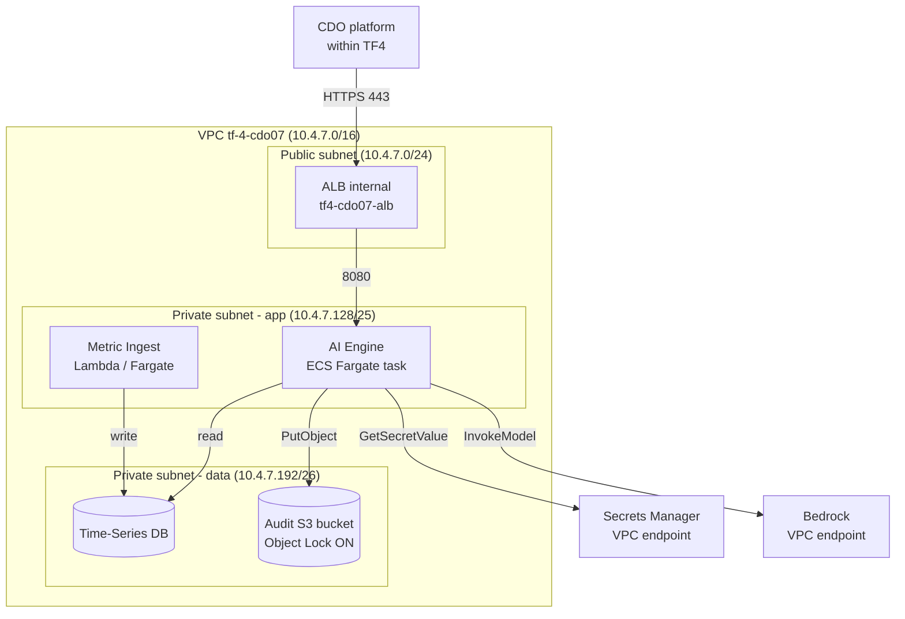

# Security Design - Task Force 4 · CDO-07

<!-- Doc owner: CDO-07
     Status: Draft (W11 T4) → Final (W11 T6 Pack #1) → Refined (W12 T4 Pack #2)
     Word target: 1200-2000 từ
     Last updated: 2026-06-22 -->

> **Scope**: DevOps-level security (network, IAM, secrets, encryption, audit).
> Không phải security audit enterprise. Focus vào những gì CDO-07 thực sự cấu hình + deploy.
>
> **W11 T6 minimum**: §1 + §2 + §3 + §4 + §5 (skeleton) + §7 (open questions)
> **W12 T4 final**: tất cả section refined với evidence (IAM policy snippets, KMS ARN, audit log sample)

---

## 1. Network Security

### 1.1 Network Diagram

<!-- TODO: Cập nhật sau khi lock angle và biết exact AWS services -->



### 1.2 Security Groups

| SG name | Inbound | Outbound | Attached to |
|---|---|---|---|
| `tf4-cdo07-alb-sg` | 443 từ TF4 task force VPC CIDR | 8080 → app-sg | ALB |
| `tf4-cdo07-app-sg` | 8080 từ alb-sg | 443 → Bedrock/SM VPC endpoint, TSDB port → data-sg | ECS Fargate tasks |
| `tf4-cdo07-data-sg` | TSDB port từ app-sg only | (none) | Timestream / RDS / AMP |
| `tf4-cdo07-ingest-sg` | TSDB write port từ ingest sources | TSDB port → data-sg | Ingest Lambda / Fargate |

### 1.3 VPC Endpoints (private traffic, không ra Internet)

| Service | Endpoint type | Purpose |
|---|---|---|
| Bedrock Runtime | Interface | AI inference - không qua NAT |
| Secrets Manager | Interface | Secret fetch - không qua NAT |
| S3 | Gateway | Audit log write, IaC state |
| CloudWatch Logs | Interface | Application log không qua NAT |

---

## 2. IAM & Access Control

### 2.1 Service Roles (least-privilege)

| Role | Used by | Key permissions | KHÔNG có |
|---|---|---|---|
| `tf4-cdo07-ai-engine-task-role` | ECS Fargate task (AI engine) | `bedrock:InvokeModel` (specific model ARN), `secretsmanager:GetSecretValue` (specific ARN), `s3:PutObject` (audit bucket only), `timestream:WriteRecords` (read), `cloudwatch:PutMetricData` | `iam:*`, `s3:Delete*`, `ec2:*` |
| `tf4-cdo07-ingest-role` | Metric ingest Lambda / Fargate | `timestream:WriteRecords`, `kinesis:GetRecords` (nếu dùng), `cloudwatch:GetMetricData` | `bedrock:*`, `iam:*` |
| `tf4-cdo07-platform-deploy-role` | GitHub Actions CI/CD | `ecs:UpdateService`, `ecr:PutImage`, `cloudformation:*` (scoped), `s3:*` (tf-state bucket only) | `iam:CreateUser`, `s3:Delete*` production |
| `tf4-cdo07-readonly-role` | Mentor review / debug access | `cloudwatch:GetMetricData`, `ecs:Describe*`, `s3:GetObject` (audit bucket) | Mọi write/mutate action |

### 2.2 OIDC cho CI/CD (không dùng static AWS key)

```yaml
# GitHub Actions - assume role via OIDC, không hardcode key
- uses: aws-actions/configure-aws-credentials@v4
  with:
    role-to-assume: arn:aws:iam::<ACCOUNT>:role/tf4-cdo07-platform-deploy-role
    aws-region: us-east-1
```

### 2.3 Permission Boundary

<!-- TODO: Attach permission boundary nếu account shared với TF khác -->
- Boundary ARN: `arn:aws:iam::<ACCOUNT>:policy/tf4-cdo07-boundary`
- Enforces: không tạo role có quyền vượt ra ngoài `tf4-cdo07-*` resource scope

---

## 3. Secrets Management

### 3.1 Secrets Inventory

| Secret | Path trong Secrets Manager | Rotation | Accessed by |
|---|---|---|---|
| Bedrock API key / region config | `tf4/cdo07/bedrock` | Manual (capstone) | ai-engine-task-role |
| DB credentials (nếu có RDS) | `tf4/cdo07/db` | 30-day auto rotation | app-sg |
| Grafana API key (annotation) | `tf4/cdo07/grafana` | Manual | ai-engine-task-role |
| Slack webhook URL | `tf4/cdo07/slack-webhook` | Manual | alert-router-role |

### 3.2 Inject Pattern

- **ECS Fargate**: secret reference trong task definition `valueFrom: arn:aws:secretsmanager:...`
  → inject thành env var tại runtime, không bake vào image
- **Lambda**: `boto3.client('secretsmanager').get_secret_value()` tại cold start + cache TTL 5min

### 3.3 Anti-leak Controls

- **Gitleaks** scan trong CI pipeline - block merge nếu detect secret pattern
- **Dockerfile review**: không có `ENV SECRET=...` trong Dockerfile
- **Application log redaction**: pattern `Bearer\s+[A-Za-z0-9\-._~+/]+=*` → `[REDACTED]`

---

## 4. Encryption

### 4.1 At Rest

| Data | Storage | Encryption | Notes |
|---|---|---|---|
| Audit log (AI decisions) | S3 `tf4-cdo07-audit-log` | CMK `tf4-cdo07-audit-cmk` | S3 Object Lock COMPLIANCE 90 ngày |
| Time-series metrics | Timestream / AMP | AWS-managed key | Encryption tại database level |
| Terraform state | S3 `tf4-cdo07-tf-state` | AWS-managed | Versioning ON, MFA delete OFF (capstone) |
| Application secrets | Secrets Manager | AWS-managed | At rest by default |

### 4.2 In Transit

- ALB listener: **TLS 1.2+** only (policy `ELBSecurityPolicy-TLS13-1-2-2021-06`)
- Service-to-service: HTTPS over bearer token JWT (mTLS = future work post-capstone)
- Bedrock invocation: HTTPS via VPC Interface Endpoint (không qua Internet)

### 4.3 KMS Key Management

- CMK rotation: **enabled**, 1-year cadence
- Key policy: only `tf4-cdo07-*` roles có access
- CloudTrail data event: **ON** cho audit CMK (ai decrypt gì đều log)

---

## 5. Audit Logging

### 5.1 What to Log

**AI prediction calls** (mọi `/v1/predict` call):
```json
{
  "timestamp": "2026-06-22T08:00:00Z",
  "tenant_id": "payment-gateway-prod",
  "service_id": "payment-gateway",
  "correlation_id": "uuid-v4",
  "input_hash": "sha256:...",
  "prediction_result": "drift_detected",
  "confidence": 0.87,
  "recommendation": "Scale RDS from db.r6g.large to db.r6g.xlarge",
  "model_version": "v1.0.0",
  "latency_ms": 420
}
```

**Infrastructure change**: CloudTrail management events (Terraform apply, ECS service update).

**Application error**: structured log với `correlation_id` để trace cross-service.

### 5.2 Storage + Retention

| Log type | Storage | Retention | Query interface |
|---|---|---|---|
| AI decision audit | S3 Object Lock + Athena | 90 ngày hot, 1 năm cold (S3 lifecycle) | Athena SQL |
| CloudTrail | S3 + CloudTrail Lake | 90 ngày | CloudTrail console |
| Application log | CloudWatch Logs | 14 ngày | Logs Insights |
| Metric ingest log | CloudWatch Logs | 7 ngày | Logs Insights |

### 5.3 PII Handling

- Schema whitelist: chỉ ingest field đã defined trong Telemetry Contract (từ AI team)
- Reject ingest nếu payload có field ngoài whitelist
- Redaction at ingest: `email`, `phone`, `card_number` pattern → `[REDACTED]`
- Unit test demo redaction working: `tests/test_pii_redaction.py`

---

## 6. Compliance Touchpoints

| Standard | Controls áp dụng (capstone scope) |
|---|---|
| SOC2 Type II | CC6.1: logical access via IAM least-privilege; CC7.2: monitoring CloudWatch; CC8.1: change management via Git + CI/CD + Terraform |
| GDPR Article 32 | Security of processing: encryption at rest + in transit, access control IAM |
| TF4-specific | Audit log mọi prediction call, encrypted at rest, retention spec'd (§5.2) |

---

## 7. Open Questions

<!-- Cập nhật sau Client interview + sau khi nhận Deployment Contract từ AI team -->

- [ ] Q1: Account structure - TF4 dùng shared account hay isolated account?
- [ ] Q2: SOC2 specific controls nào Client cần evidence cho (relevant với fintech context)?
- [ ] Q3: Audit log format - JSON đủ hay cần signed/hash chain?
- [ ] Q4: Cross-tenant isolation level - service-level silo hay pool+row-filter đủ?

---

## Related documents

- [`02_infra_design.md`](02_infra_design.md) - Network topology source of truth
- [`04_deployment_design.md`](04_deployment_design.md) - CI/CD security gates (gitleaks, OIDC)
- [`08_adrs.md`](08_adrs.md) - ADR-004 (audit storage), ADR-005 (encryption strategy)
