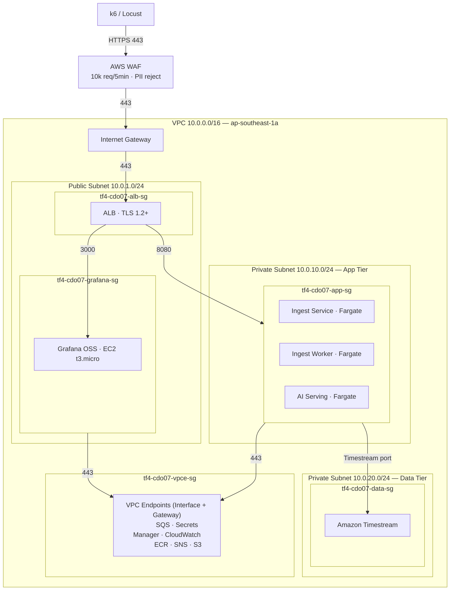

# Security Design - Task Force 4 · CDO-07

<!-- Doc owner: CDO-07
     Status: Draft (W11 T4) → Final (W11 T6 Pack #1) → Refined (W12 T4 Pack #2)
     Word target: 1200-2000 từ
     Last updated: 2026-06-22 -->

> **Scope**: DevOps-level security (network, IAM, secrets, encryption, audit).
> Không phải security audit enterprise. Focus vào những gì CDO-07 thực sự cấu hình + deploy.
>
> **W11 T6 minimum**: §1 + §2 + §3 + §4 + §5 (skeleton) + §7 (open questions)
> **W12 T4 final**: tất cả section refined với evidence (IAM policy snippets, KMS ARN, audit log sample)

---

## 1. Network Security

### 1.1 Network Security Diagram

<!-- Focus: security boundaries (SG zones), allowed ports, VPC Endpoint isolation.
     Architecture data-flow → xem 02_infra_design.md §1. -->



### 1.2 Security Groups

| SG name | Inbound | Outbound | Attached to |
|---|---|---|---|
| `tf4-cdo07-alb-sg` | 443 (HTTPS) từ AWS WAF qua IGW | 8080 → `tf4-cdo07-app-sg` | Application Load Balancer |
| `tf4-cdo07-app-sg` | 8080 từ `tf4-cdo07-alb-sg` only | 443 → VPC Endpoints (SQS, Secrets Manager, CloudWatch, ECR); Timestream port → `tf4-cdo07-data-sg` | Ingest Service, Ingest Worker, AI Serving (ECS Fargate) |
| `tf4-cdo07-data-sg` | Timestream port từ `tf4-cdo07-app-sg` only | (none — stateful response only) | Amazon Timestream |
| `tf4-cdo07-grafana-sg` | 3000 từ `tf4-cdo07-alb-sg` (Grafana UI) | 443 → CloudWatch VPC Endpoint | Grafana OSS (EC2 t3.micro) |
| `tf4-cdo07-vpce-sg` | 443 từ `tf4-cdo07-app-sg`, `tf4-cdo07-grafana-sg` | (none) | Tất cả Interface VPC Endpoints |

> **Nguyên tắc**: Mọi SG đều dùng **source SG reference** thay vì CIDR trực tiếp để đảm bảo implicit deny khi service bị detach.

### 1.3 VPC Endpoints (private traffic, không ra Internet)

| Service | Endpoint type | Purpose |
|---|---|---|
| SQS | Interface | Ingest Service enqueue / Ingest Worker poll — không qua NAT |
| Secrets Manager | Interface | AI Serving + Ingest Worker lấy secret tại runtime |
| CloudWatch Logs | Interface | Đẩy application log từ App Tier — không qua NAT |
| CloudWatch Monitoring | Interface | Grafana OSS query metric — không qua NAT |
| ECR (API + Docker) | Interface | Pull container image cho ECS tasks — không qua NAT |
| S3 | Gateway | Audit log write (SSE-KMS), Baseline Models read, Terraform state |
| SNS | Interface | AI Serving gửi alert notification — không qua NAT |

> **Lưu ý**: Không triển khai NAT Gateway — toàn bộ outbound traffic AWS service đi qua VPC Endpoints. Tiết kiệm chi phí NAT (~$32/tháng) phù hợp budget cap $200/tháng.

### 1.4 AWS WAF (Edge Protection)

| Rule | Mô tả | Action |
|---|---|---|
| Rate-limit | ≤ 10,000 req/5min per IP | Block + CloudWatch metric |
| PII regex reject | Reject payload chứa PII pattern (email, phone, card_number) | Block |
| Schema whitelist | Chỉ accept payload fields đã defined trong Telemetry Contract | Block |
| SQL injection / XSS | AWS Managed Rules `AWSManagedRulesCommonRuleSet` | Block |

---

## 2. IAM & Access Control

### 2.1 Service Roles (least-privilege)

| Role | Used by | Key permissions | KHÔNG có |
|---|---|---|---|
| `tf4-cdo07-ai-serving-task-role` | AI Serving (ECS Fargate) | `timestream:Select` (read query 2h window), `timestream:DescribeEndpoints`, `s3:PutObject` (audit bucket `tf4-cdo07-audit-log`), `s3:GetObject` (baseline bucket `tf4-cdo07-baseline-models`), `secretsmanager:GetSecretValue` (ARN `tf4/cdo07/*`), `sns:Publish` (alert topic ARN), `cloudwatch:PutMetricData`, `logs:PutLogEvents`, `kms:GenerateDataKey`, `kms:Decrypt` (CMK ARN) | `iam:*`, `s3:Delete*`, `ec2:*`, `timestream:WriteRecords` |
| `tf4-cdo07-ingest-svc-task-role` | Ingest Service (ECS Fargate) | `sqs:SendMessage` (ingest queue ARN), `cloudwatch:PutMetricData`, `logs:PutLogEvents`, `kms:GenerateDataKey` (encrypt SQS message) | `timestream:*`, `s3:*`, `iam:*` |
| `tf4-cdo07-ingest-worker-task-role` | Ingest Worker (ECS Fargate) | `sqs:ReceiveMessage`, `sqs:DeleteMessage` (ingest queue ARN), `timestream:WriteRecords` (BatchWrite), `timestream:DescribeEndpoints`, `cloudwatch:PutMetricData`, `logs:PutLogEvents`, `kms:Decrypt` (decrypt SQS message) | `sqs:CreateQueue`, `iam:*`, `s3:*` |
| `tf4-cdo07-grafana-ec2-role` | Grafana OSS (EC2 t3.micro) | `cloudwatch:GetMetricData`, `cloudwatch:ListMetrics`, `cloudwatch:GetDashboard`, `timestream:Select` (read-only), `timestream:DescribeEndpoints`, `logs:GetLogEvents` | Mọi write/mutate action, `iam:*` |
| `tf4-cdo07-eventbridge-invoke-role` | EventBridge (trigger `rate(5 minutes)`) | `ecs:RunTask` (scoped ARN cho AI Serving task) | `iam:*`, `s3:*`, `ec2:*` |
| `tf4-cdo07-platform-deploy-role` | GitHub Actions CI/CD (OIDC) | `ecs:UpdateService`, `ecs:RegisterTaskDefinition`, `ecr:PutImage`, `ecr:GetAuthorizationToken`, `s3:PutObject` (tf-state bucket), `cloudformation:*` (scoped `tf4-cdo07-*` stack) | `iam:CreateUser`, `iam:CreateRole` (ngoài boundary), `s3:Delete*` production |
| `tf4-cdo07-readonly-role` | Mentor review / debug access | `cloudwatch:GetMetricData`, `ecs:Describe*`, `timestream:Select`, `s3:GetObject` (audit bucket), `logs:GetLogEvents` | Mọi write/mutate action |

### 2.2 OIDC cho CI/CD (không dùng static AWS key)

```yaml
# GitHub Actions - assume role via OIDC, không hardcode AWS Access Key
- uses: aws-actions/configure-aws-credentials@v4
  with:
    role-to-assume: arn:aws:iam::<ACCOUNT>:role/tf4-cdo07-platform-deploy-role
    aws-region: ap-southeast-1
```

> **Tại sao OIDC?** Eliminates static credentials (AWS_ACCESS_KEY_ID / SECRET) khỏi GitHub Secrets. Token tự expire sau 1h, giảm blast radius nếu CI runner bị compromise.

### 2.3 Permission Boundary

- Boundary ARN: `arn:aws:iam::<ACCOUNT>:policy/tf4-cdo07-boundary`
- Enforces: không cho phép bất kỳ role nào tạo bởi `tf4-cdo07-platform-deploy-role` có quyền vượt ra ngoài `tf4-cdo07-*` resource scope
- Áp dụng: Attach vào tất cả IAM roles thuộc project CDO-07

```json
{
  "Version": "2012-10-17",
  "Statement": [
    {
      "Sid": "CDO07ResourceScope",
      "Effect": "Allow",
      "Action": "*",
      "Resource": [
        "arn:aws:*:ap-southeast-1:<ACCOUNT>:*tf4-cdo07*",
        "arn:aws:s3:::tf4-cdo07-*",
        "arn:aws:s3:::tf4-cdo07-*/*"
      ]
    },
    {
      "Sid": "DenyEscalation",
      "Effect": "Deny",
      "Action": [
        "iam:CreateUser",
        "iam:CreateAccessKey",
        "iam:AttachUserPolicy",
        "organizations:*"
      ],
      "Resource": "*"
    }
  ]
}
```

### 2.4 Resource Tagging Policy

Tất cả AWS resource phải có tag bắt buộc để phục vụ access control, cost allocation và audit:

| Tag Key | Value | Mục đích |
|---|---|---|
| `Project` | `foresight-lens` | Cost allocation, resource grouping |
| `Team` | `CDO-07` | Ownership identification |
| `Environment` | `capstone` | Environment classification |
| `ManagedBy` | `terraform` | Drift detection, compliance |

### 2.5 Cross-account Access

- **Không có cross-account access** trong phạm vi capstone. Toàn bộ resource nằm trong single AWS account.
- Nếu mở rộng production (multi-account): sử dụng `sts:AssumeRole` cross-account với external ID + condition key `aws:SourceAccount`. Document trong ADR khi cần.
- **K8s RBAC**: Không applicable — project dùng ECS Fargate, không dùng EKS.

---

## 3. Secrets Management

### 3.1 Secrets Inventory

| Secret | Path trong Secrets Manager | Rotation | Accessed by |
|---|---|---|---|
| Grafana API key (drift annotation) | `tf4/cdo07/grafana` | Manual (capstone) | `tf4-cdo07-ai-serving-task-role` |

**Không applicable trong project này:**

| Secret (template requirement) | Lý do không có |
|---|---|
| Bedrock / LLM API key | "LLM-based prediction – Không sử dụng do chi phí cao". Dùng statistical/ML-based forecasting |
| DB credentials (RDS) | Database là Timestream serverless — IAM auth, không cần credentials |
| Webhook signing key | Project dùng Amazon SNS cho alerting (push model), không expose webhook endpoint. Không có third-party callback cần verify signature |
| Slack webhook URL | Alerting qua SNS → email, không dùng Slack |

> **Phân loại config**: SQS Queue URL, SNS Topic ARN, Timestream endpoint là **infrastructure config** — inject qua **ECS Task Definition environment variable** hoặc **SSM Parameter Store**, không lưu trong Secrets Manager.

### 3.2 Inject Pattern

- **ECS Fargate (Ingest Worker, AI Serving, Ingest Service)**: secret reference trong task definition:
  ```json
  {
    "name": "GRAFANA_API_KEY",
    "valueFrom": "arn:aws:secretsmanager:ap-southeast-1:<ACCOUNT>:secret:tf4/cdo07/grafana"
  }
  ```
  → Inject thành environment variable tại runtime, **không bake vào Docker image**.
- **Infrastructure config (non-secret)**: inject trực tiếp qua ECS Task Definition environment:
  ```json
  [
    {"name": "SQS_QUEUE_URL", "value": "https://sqs.ap-southeast-1.amazonaws.com/<ACCOUNT>/tf4-cdo07-ingest-queue"},
    {"name": "SNS_TOPIC_ARN", "value": "arn:aws:sns:ap-southeast-1:<ACCOUNT>:tf4-cdo07-alerts"},
    {"name": "TIMESTREAM_DB", "value": "tf4-cdo07-metrics"},
    {"name": "S3_AUDIT_BUCKET", "value": "tf4-cdo07-audit-log"},
    {"name": "S3_BASELINE_BUCKET", "value": "tf4-cdo07-baseline-models"}
  ]
  ```

### 3.3 Anti-leak Controls

- **Gitleaks** scan trong CI pipeline — block merge nếu detect secret pattern (AWS key, private key, token)
- **Dockerfile review checklist**: không có `ENV SECRET=...`, `ARG PASSWORD=...` trong any Dockerfile
- **Application log redaction**: pattern matching tại application layer:
  - `Bearer\s+[A-Za-z0-9\-._~+/]+=*` → `[REDACTED]`
  - `AKIA[0-9A-Z]{16}` → `[AWS_KEY_REDACTED]`
  - `aws_secret_access_key\s*=\s*\S+` → `[REDACTED]`
- **ECR image scanning**: Enable Amazon ECR image scanning (Basic + Enhanced via Inspector) — block deployment nếu có CRITICAL/HIGH CVE
- **Pre-commit hook**: `.pre-commit-config.yaml` include `detect-secrets` để chặn secret trước khi commit

---

## 4. Encryption

### 4.1 At Rest

| Data | Storage | Encryption | Notes |
|---|---|---|---|
| Audit log (AI decisions) | S3 `tf4-cdo07-audit-log` | CMK `tf4-cdo07-audit-cmk` | S3 Object Lock COMPLIANCE 90 ngày |
| Time-series metrics | Timestream / AMP | AWS-managed key | Encryption tại database level |
| Terraform state | S3 `tf4-cdo07-tf-state` | AWS-managed | Versioning ON, MFA delete OFF (capstone) |
| Application secrets | Secrets Manager | AWS-managed | At rest by default |

### 4.2 In Transit

- ALB listener: **TLS 1.2+** only (policy `ELBSecurityPolicy-TLS13-1-2-2021-06`)
- Service-to-service: HTTPS over bearer token JWT (mTLS = future work post-capstone)
- Bedrock invocation: HTTPS via VPC Interface Endpoint (không qua Internet)

### 4.3 KMS Key Management

- CMK rotation: **enabled**, 1-year cadence
- Key policy: only `tf4-cdo07-*` roles có access
- CloudTrail data event: **ON** cho audit CMK (ai decrypt gì đều log)

---

## 5. Audit Logging

### 5.1 What to Log

**AI prediction calls** (mọi `/v1/predict` call):
```json
{
  "timestamp": "2026-06-22T08:00:00Z",
  "tenant_id": "payment-gateway-prod",
  "service_id": "payment-gateway",
  "correlation_id": "uuid-v4",
  "input_hash": "sha256:...",
  "prediction_result": "drift_detected",
  "confidence": 0.87,
  "recommendation": "Scale RDS from db.r6g.large to db.r6g.xlarge",
  "model_version": "v1.0.0",
  "latency_ms": 420
}
```

**Infrastructure change**: CloudTrail management events (Terraform apply, ECS service update).

**Application error**: structured log với `correlation_id` để trace cross-service.

### 5.2 Storage + Retention

| Log type | Storage | Retention | Query interface |
|---|---|---|---|
| AI decision audit | S3 Object Lock + Athena | 90 ngày hot, 1 năm cold (S3 lifecycle) | Athena SQL |
| CloudTrail | S3 + CloudTrail Lake | 90 ngày | CloudTrail console |
| Application log | CloudWatch Logs | 14 ngày | Logs Insights |
| Metric ingest log | CloudWatch Logs | 7 ngày | Logs Insights |

### 5.3 PII Handling

- Schema whitelist: chỉ ingest field đã defined trong Telemetry Contract (từ AI team)
- Reject ingest nếu payload có field ngoài whitelist
- Redaction at ingest: `email`, `phone`, `card_number` pattern → `[REDACTED]`
- Unit test demo redaction working: `tests/test_pii_redaction.py`

---

## 6. Compliance Touchpoints

| Standard | Controls áp dụng (capstone scope) |
|---|---|
| SOC2 Type II | CC6.1: logical access via IAM least-privilege; CC7.2: monitoring CloudWatch; CC8.1: change management via Git + CI/CD + Terraform |
| GDPR Article 32 | Security of processing: encryption at rest + in transit, access control IAM |
| TF4-specific | Audit log mọi prediction call, encrypted at rest, retention spec'd (§5.2) |

---

## 7. Open Questions

<!-- Cập nhật sau Client interview + sau khi nhận Deployment Contract từ AI team -->

- [ ] Q1: Account structure - TF4 dùng shared account hay isolated account?
- [ ] Q2: SOC2 specific controls nào Client cần evidence cho (relevant với fintech context)?
- [ ] Q3: Audit log format - JSON đủ hay cần signed/hash chain?
- [ ] Q4: Cross-tenant isolation level - service-level silo hay pool+row-filter đủ?

---

## Related documents

- [`02_infra_design.md`](02_infra_design.md) - Network topology source of truth
- [`04_deployment_design.md`](04_deployment_design.md) - CI/CD security gates (gitleaks, OIDC)
- [`08_adrs.md`](08_adrs.md) - ADR-004 (audit storage), ADR-005 (encryption strategy)
